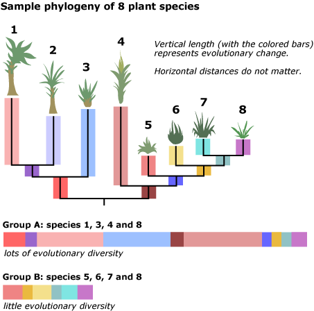

Introduction to biodiversity and data science
=============================================

What is biodiversity?
---------------------

- **Species diversity**
  - Number of species in an ecological community, landscape or region
  - Perhaps taking abundance into account
- **Phylogenetic diversity**
  - What does it measure, and how?
  - Can it be high when species diversity is low (or vice versa)?
- **Functional diversity**
  - What does it measure, and how?
  - Can it be high when species diversity is low (or vice versa)?
  - How might it relate to species or phylogenetic diversity?

Species richness
----------------

 
**Species accumulation curves** for pollinator, plant, bee and 
[syrphid](https://en.wikipedia.org/wiki/Hoverfly) diversity with 95%
confidence intervals using the method “random” in the package 
[vegan](https://cran.r-project.org/web/packages/vegan/index.html) from the statistical
program R

(From: **EI Hennig & J Ghazoul**, 2012. Pollinating animals in the urban environment.
_Urban Ecosystems_ **15**(1): 149–166
doi:[10.1007/s11252-011-0202-7](http://doi.org/10.1007/s11252-011-0202-7))

Biases among biodiversity data sets are pervasive:

- **Species counts / checklists** - vary by expended effort
- **Sequencing results** - vary likewise, by expended effort but also due to chemistry
- **Occurrence data** - expended effort, biases through time and space

Broad spatial patterns of species richness
------------------------------------------

- **Species-area curve** - more species in larger areas
- **S = CAz**
- **log(S) = log(C) + z * log(A)**
  - **S** = Species richness
  - **C** = constant
  - **A** = Area
  - **z** = constant

Uncertainty in species-area relationships
-----------------------------------------

- _The results revealed a high level of uncertainty in model selection across biomes and 
  taxa, and that the power-law model is clearly the most appropriate in only a minority 
  of cases._
- _Our findings suggest that the results of analyses that assume a power-law model may be 
  at severe odds with real ecological patterns [...]._

**F Guilhaumon, O Gimenez, KJ Gaston, & D Mouillot**, 2008. Taxonomic and 
regional uncertainty in species-area relationships and the identification of richness 
hotspots. _PNAS_ **105**(40): 15458–15463 
doi:[10.1073/pnas.0803610105](http://doi.org/10.1073/pnas.0803610105)

Incorporating relatedness and evolutionary history
--------------------------------------------------

- Species diversity is not very informative
- The same numbers of species might correspond with different amounts of phylogenetic
  diversity (PD)
- High amounts of PD seem to correspond with large amounts of biomass

- _[...] functional and ecological similarities are shaped by patterns of common ancestry, 
  such that distantly related species might contribute more to production than close 
  relatives, perhaps by increasing niche breadth._
- _We show that the amount of phylogenetic diversity within communities explained 
  significantly more variation in plant community biomass than other measures of 
  diversity, such as the number of species or functional groups._

**MW Cadotte, BJ Cardinale, & TH Oakley**, 2008. Evolutionary history and the effect of 
biodiversity on plant productivity. _PNAS_ **105**(44): 17012–17017 
doi:[10.1073/pnas.0805962105](http://doi.org/10.1073/pnas.0805962105)

Phylogenetic diversity versus species diversity
-----------------------------------------------

**TJ Davies & LB Buckley**, 2011. Phylogenetic diversity as a window into the 
evolutionary and biogeographic histories of present-day richness gradients for mammals.
_Philos Trans R Soc Lond B Biol Sci_ **366**: 2414–2425
doi:[10.1098/rstb.2011.0058](http://doi.org/10.1098/rstb.2011.0058) 

- PD may explain some patterns better than species diversity, but it has its own
  dynamics as well.
- For example, South America shows low richness of old mammal lineages, with tropical 
  lineage diversity only approaching that for Africa within the last 20 Mya. 
- Probably explained by the extratropical origins of clades that subsequently diversified
  in South America following successive migration events and the formation of the 
  [Isthmus of Panama](https://en.wikipedia.org/wiki/Isthmus_of_Panama) (±3MYA)

Residuals (millions of years) from a LOESS regression of cell PD against cell species 
number. Blue = less PD than expected, red = more than expected.

----

Source: [10.1038/nature12529](http://doi.org/10.1038/nature12529)

Patterns of biodiversity
------------------------

- alpha diversity: within a single extent of time and space
- beta diversity: the turnover between locations or time windows
- gamma diversity: the total diversity in a system

Measuring biodiversity
----------------------

- Molecular techniques (week 1)
- Field observations (week 2)
- Trait/character measurements (week 3)

Biodiversity data
-----------------
- Many different types
- At different scales: molecules to ecosystems
- High dimensionality
- High volume
- An explosion of digital sensors:
  - HTS DNA sequencers
  - Remote sensing satellites and drones
  - Digital cameras

The data cycle
--------------

Data science
------------
The dirty work throughout the data cycle, leading up to, and including, 
statistical analysis:

- Representation and modeling of collected data
- Data processing: cleaning, filtering, reduction, integration
- Data management: metadata, versioning, formats
- Handling scalability challenges, e.g. through automation
- And finally: analyzing, visualizing, and interpreting data

Representation and modeling of collected data
---------------------------------------------
- How is sequencing data represented over the course of the data cycle, 
  what does it capture, how is it annotated with additional information?
- How is geospatial data represented? There are different data types
  (e.g. number types, pixel values), different scaling levels, 
  different coordinate systems, etc.
- How is graph-like data represented? For example, how to traverse
  very large trees or networks?
- How to represent idiosyncratic traits and characters?

Data processing
---------------

- To go from raw data capture to useable data, a lot of cleaning, 
  filtering, format conversion, and reduction (volume and dimensionality)
  needs to take place.
- To make data that is useable _to you_ also useful to others, data
  integration techniques need to be considered. For example, how to
  combine your molecular sequences (and phylogenies) with occurrences
  and traits from public databases?

Data management
---------------

- How to manage versions of data, their history, and provenance?
- How to store and share data?
- How to represent, store, and share what we know _about_ the data?

Automation
----------
- Too much data to do 'by hand'
- Reproducibility is easier with automation
- We will explore this using the UNIX/Linux shell, using R, and scripting
  languages (a bit of Python and Perl)

Tools of the trade
------------------
- UNIX/Linux operating systems
- Scripting languages
- Relational databases
- Versioning
- Documentation systems
