Introduction to biodiversity and data science
=============================================

What is biodiversity?
---------------------

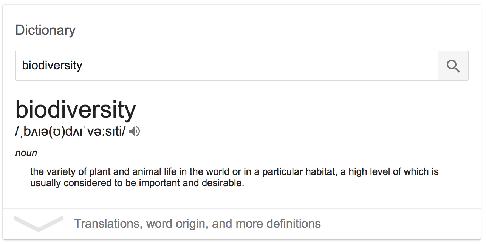

- **Species diversity**
  - Number of species in an ecological community, landscape or region
  - Perhaps taking abundance into account
- **Phylogenetic diversity**
  - What does it measure, and how?
  - Can it be high when species diversity is low (or vice versa)?
- **Functional diversity**
  - What does it measure, and how?
  - Can it be high when species diversity is low (or vice versa)?
  - How might it relate to species or phylogenetic diversity?

Species richness
----------------

 
**Species accumulation curves** for pollinator, plant, bee and 
[syrphid](https://en.wikipedia.org/wiki/Hoverfly) diversity with 95%
confidence intervals using the method “random” in the package 
[vegan](https://cran.r-project.org/web/packages/vegan/index.html) from the statistical
program R

(From: **EI Hennig & J Ghazoul**, 2012. Pollinating animals in the urban environment.
_Urban Ecosystems_ **15**(1): 149–166
doi:[10.1007/s11252-011-0202-7](http://doi.org/10.1007/s11252-011-0202-7))

Biases among biodiversity data sets are pervasive:

- **Species counts / checklists** - vary by expended effort
- **Sequencing results** - vary likewise, by expended effort but also due to chemistry
- **Occurrence data** - expended effort, biases through time and space

Broad spatial patterns of species richness
------------------------------------------

- **Species-area curve** - more species in larger areas
- **S = CAz**
- **log(S) = log(C) + z * log(A)**
  - **S** = Species richness
  - **C** = constant
  - **A** = Area
  - **z** = constant

Uncertainty in species-area relationships
-----------------------------------------

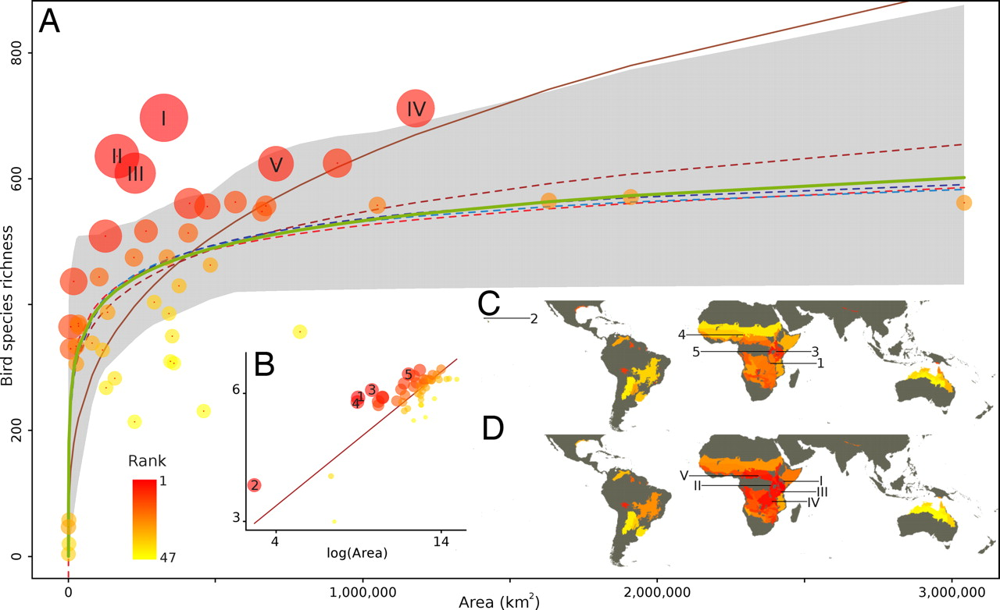

- _The results revealed a high level of uncertainty in model selection across biomes and 
  taxa, and that the power-law model is clearly the most appropriate in only a minority 
  of cases._
- _Our findings suggest that the results of analyses that assume a power-law model may be 
  at severe odds with real ecological patterns [...]._

**F Guilhaumon, O Gimenez, KJ Gaston, & D Mouillot**, 2008. Taxonomic and 
regional uncertainty in species-area relationships and the identification of richness 
hotspots. _PNAS_ **105**(40): 15458–15463 
doi:[10.1073/pnas.0803610105](http://doi.org/10.1073/pnas.0803610105)

Incorporating relatedness and evolutionary history
--------------------------------------------------

- Species diversity is not very informative
- The same numbers of species might correspond with different amounts of phylogenetic
  diversity (PD)
- High amounts of PD seem to correspond with large amounts of biomass

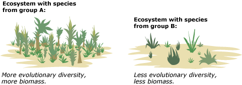

- _[...] functional and ecological similarities are shaped by patterns of common ancestry, 
  such that distantly related species might contribute more to production than close 
  relatives, perhaps by increasing niche breadth._
- _We show that the amount of phylogenetic diversity within communities explained 
  significantly more variation in plant community biomass than other measures of 
  diversity, such as the number of species or functional groups._

**MW Cadotte, BJ Cardinale, & TH Oakley**, 2008. Evolutionary history and the effect of 
biodiversity on plant productivity. _PNAS_ **105**(44): 17012–17017 
doi:[10.1073/pnas.0805962105](http://doi.org/10.1073/pnas.0805962105)

Phylogenetic diversity versus species diversity
-----------------------------------------------

**TJ Davies & LB Buckley**, 2011. Phylogenetic diversity as a window into the 
evolutionary and biogeographic histories of present-day richness gradients for mammals.
_Philos Trans R Soc Lond B Biol Sci_ **366**: 2414–2425
doi:[10.1098/rstb.2011.0058](http://doi.org/10.1098/rstb.2011.0058) 

- PD may explain some patterns better than species diversity, but it has its own
  dynamics as well.
- For example, South America shows low richness of old mammal lineages, with tropical 
  lineage diversity only approaching that for Africa within the last 20 Mya. 
- Probably explained by the extratropical origins of clades that subsequently diversified
  in South America following successive migration events and the formation of the 
  [Isthmus of Panama](https://en.wikipedia.org/wiki/Isthmus_of_Panama) (±3MYA)

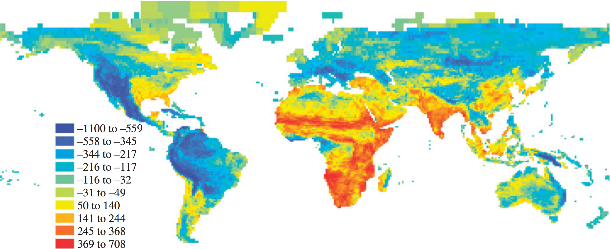

Residuals (millions of years) from a LOESS regression of cell PD against cell species 
number. Blue = less PD than expected, red = more than expected.

Functional diversity
--------------------

**OL Petchey & KJ Gaston**, 2006. Functional diversity: back to basics and looking 
forward. _Ecology Letters_ **9**(6): 741–758
doi:[10.1111/j.1461-0248.2006.00924.x](http://doi.org/10.1111/j.1461-0248.2006.00924.x)

Functional diversity concerns the range of things that organisms do (mediated by their
traits) in communities and ecosystems. Selecting and analyzing traits to incorporate in
FD calculations is complicated:

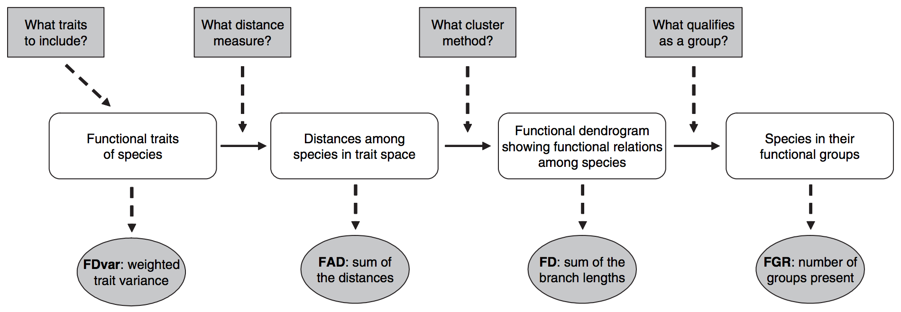

- **FDvar** [Mason et al., 2003](http://doi.org/10.1111/j.1654-1103.2003.tb02184.x)
- **FAD** [Walker et al., 1999](http://doi.org/10.1007/s100219900062)
- **FD** [Petchey & Gaston, 2002](http://doi.org/10.1046/j.1461-0248.2002.00339.x)

Functional diversity versus species diversity
---------------------------------------------

**RD Stuart-Smith et al.**, 2013. Integrating abundance and functional traits reveals new 
global hotspots of fish diversity. _Nature_ **501**: 539–542 
doi:[10.1038/nature12529](http://doi.org/10.1038/nature12529)

In reef fish diversity, highest diversity at the equator, and decreasing towards the 
poles, with highest diversity concentrated in the so-called 'Coral Triangle.'

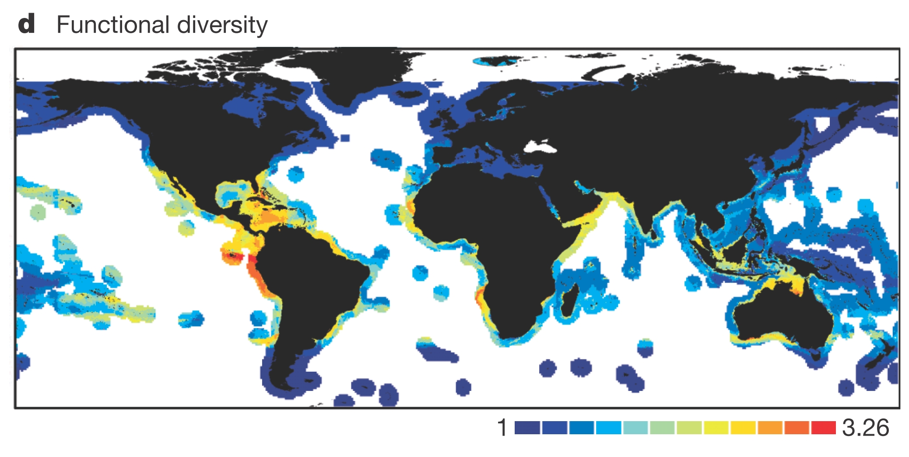

...But if we look at not just richness, but what species are doing, we find a very 
different pattern. This map suggests that the Coral Triangle is one of the least 
functionally diverse places on the planet. In other words, it harbors a lot of species, 
but in general, they are all doing more or less the same thing. 

Broad spatial patterns of functional diversity
----------------------------------------------

Source: [10.1038/nature12529](http://doi.org/10.1038/nature12529)

How different diversity measures interact
-----------------------------------------

**PL Thompson, TJ Davies & A Gonzalez**, 2015. Ecosystem Functions across Trophic Levels 
Are Linked to Functional and Phylogenetic Diversity. _PLoS ONE_ **10**(2): e0117595
doi:[10.1371/journal.pone.0117595](https://doi.org/10.1371/journal.pone.0117595)

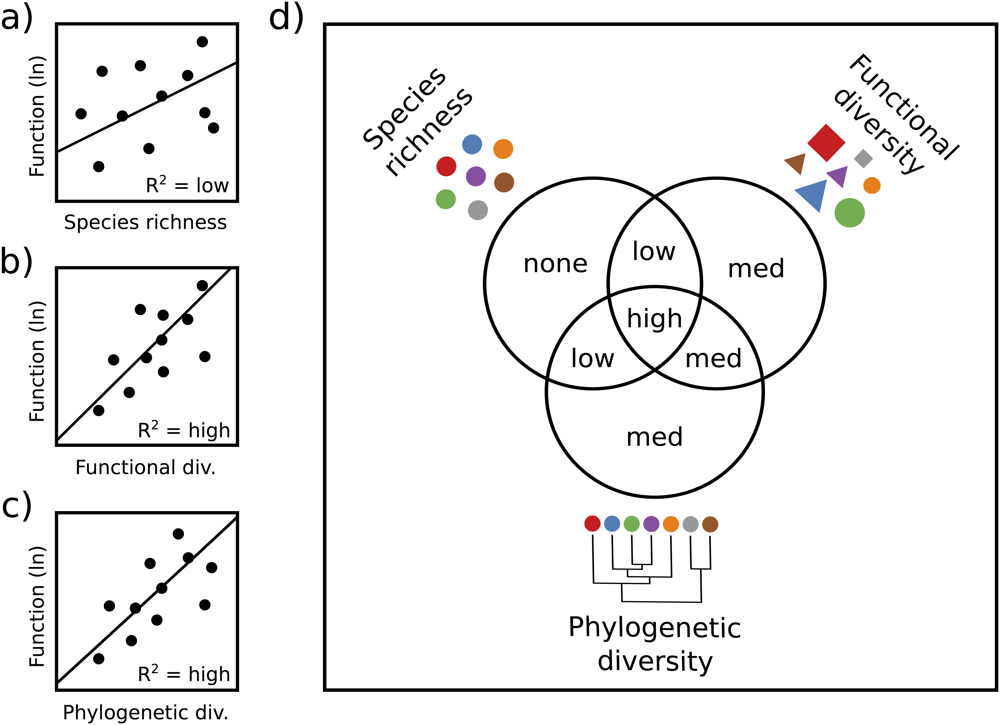

**Hypothesized relationships between ecosystem function and species richness (a), 
functional diversity (b), and phylogenetic diversity (c).**

_We predict a stronger relationship with ecosystem function, and thus a higher 
R2, for functional diversity **(b)** and phylogenetic diversity **(c)** than 
for species richness **(a)** because the former two measures incorporate information 
about the traits, or the evolutionary similarity of the different species in the 
community. Panel **(d)** depicts the results of variation partitioning, indicating our 
hypothesis that functional and phylogenetic diversity will explain all of the variation 
explained by species richness, as well as additional variation, both overlapping and 
unique._

Patterns of biodiversity
------------------------

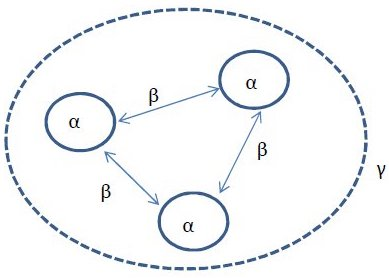

- **alpha (α)** diversity: within a single extent of time and space
- **beta (β)** diversity: the turnover between locations or time windows
- **gamma (γ)** diversity: the total diversity in a system

Research questions surrounding, for example, latitudinal gradients in diversity can thus
by couched in terms of α, β and γ diversity.

Measuring biodiversity
----------------------

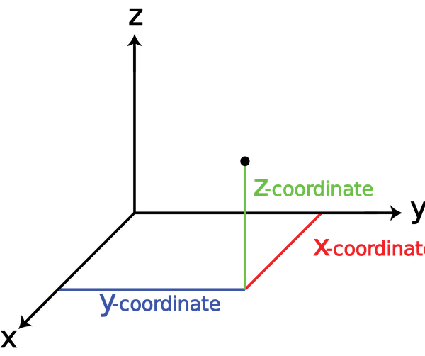

- **Molecular techniques**, i.e. one-dimensional biomolecular sequence data, which allows 
  us to sample species diversity and phylogenetic diversity (week 1)
- **Occurrences**, i.e. two-dimensional (lat/lon) coordinate data, combined with climate, 
  land use, remote sensing, etc., to identify spatial patterns (week 2)
- **Trait/character measurements**, i.e. multidimensional data, to explore functional 
  diversity (week 3)

Biodiversity data
-----------------
- Many different types
- At different scales: molecules to ecosystems
- High dimensionality
- High volume
- An explosion of digital sensors:
  - HTS DNA sequencers
  - Remote sensing satellites and drones
  - Digital cameras

The "data life cycle"
---------------------

Biodiversity data, like all research data, needs to be managed properly throughout the 
_data life cycle_:

- **Data creation** - e.g. in a lab when a sequencing assay is run
- **Data processing** - any quality filtering, dimensionality reduction
- **Data analysis** - all substantial calculations and hypothesis tests
- **Data preservation** - store data and metadata for perpetuity
- **Data access** - allow stored data to be accessed, considering interoperability
- **Data reuse** - stand on the shoulders of others

"Data science"
--------------

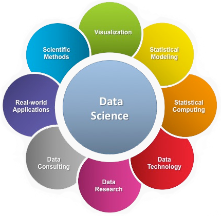

_Data science_ is concerned with the dirty work throughout the data cycle:

- **Representation** and modeling of collected data, e.g. how to represent sequence data
  and metadata in efficient ways
- **Data processing**: cleaning, for example removing low quality observations, filtering
  data to observations of interest, reduction, integration
- **Data management**: technological issues surrounding metadata, versioning, 
  interoperability, preservation and access
- **Handling scalability**: technological challenges and solutions, e.g. automation
- And finally: **analyzing, visualizing, and interpreting data**

Representation and modeling of collected data
---------------------------------------------
- How is sequencing data represented over the course of the data cycle, 
  what does it capture, how is it annotated with additional information?
- How is geospatial data represented? There are different data types
  (e.g. number types, pixel values), different scaling levels, 
  different coordinate systems, etc.
- How is graph-like data represented? For example, how to traverse
  very large trees or networks?
- How to represent idiosyncratic traits and characters?

Data processing
---------------

- To go from raw data capture to useable data, a lot of cleaning, 
  filtering, format conversion, and reduction (volume and dimensionality)
  needs to take place.
- To make data that is useable _to you_ also useful to others, data
  integration techniques need to be considered. For example, how to
  combine your molecular sequences (and phylogenies) with occurrences
  and traits from public databases?

Methods in biodiversity data analysis
-------------------------------------

**Biomolecular sequences**
- Sequence clustering and species delimitation
- _De novo_ and mapping assembly, annotation, and variant calling
- Phylogenetic analysis, tree shape analysis, molecular selection analysis

**Geospatial data**
- GIS operations
- Ecological niche modeling
- Projections

**Traits and characters**
- Comparative analysis
- Functional diversity
- Trait-dependent diversification 

Analysis workflows
------------------

- Too much data to do 'by hand'
- Reproducibility is easier with automation
- We will explore this using the UNIX/Linux shell, using R, and scripting
  languages (a bit of Python and Perl)

Data management
---------------

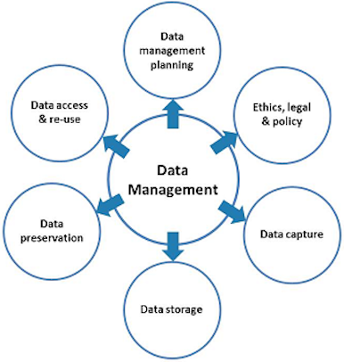

- How to manage versions of data, their history, and provenance?
- How to store and share data?
- How to represent, store, and share what we know _about_ the data?

Tools of the trade
------------------

- UNIX/Linux operating systems and [shell](http://swcarpentry.github.io/shell-novice/)
- Scripting languages, especially 
  [python](http://swcarpentry.github.io/python-novice-inflammation/) and
  [R](http://swcarpentry.github.io/r-novice-inflammation/)
- Relational databases and [SQL](http://swcarpentry.github.io/sql-novice-survey/)
- Versioning with [git](http://swcarpentry.github.io/git-novice/)
- Documentation systems
