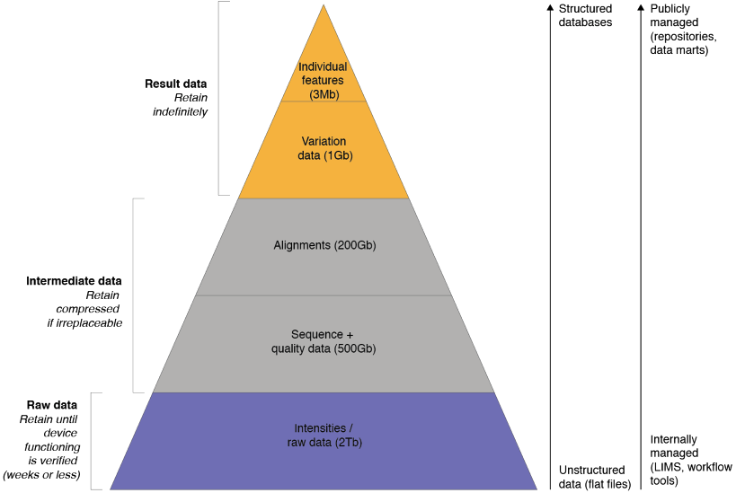

Introduction to biodiversity and data science
=============================================

What is biodiversity?
---------------------

- **Species diversity**
- **Phylogenetic diversity**
  - What does it measure, and how?
  - Can it be high when species diversity is low (or vice versa)?
- **Functional diversity**
  - What does it measure, and how?
  - Can it be high when species diversity is low (or vice versa)?
  - How might it relate to species or phylogenetic diversity?

----

Source: [10.1038/nature12529](http://doi.org/10.1038/nature12529)

Patterns of biodiversity
------------------------

- alpha diversity: within a single extent of time and space
- beta diversity: the turnover between locations or time windows
- gamma diversity: the total diversity in a system

Measuring biodiversity
----------------------

- Molecular techniques (week 1)
- Field observations (week 2)
- Trait/character measurements (week 3)

Biodiversity data
-----------------
- Many different types
- At different scales: molecules to ecosystems
- High dimensionality
- High volume
- An explosion of digital sensors:
  - HTS DNA sequencers
  - Remote sensing satellites and drones
  - Digital cameras

The data cycle
--------------

Data science
------------
The dirty work throughout the data cycle, leading up to, and including, 
statistical analysis:

- Representation and modeling of collected data
- Data processing: cleaning, filtering, reduction, integration
- Data management: metadata, versioning, formats
- Handling scalability challenges, e.g. through automation
- And finally: analyzing, visualizing, and interpreting data

Representation and modeling of collected data
---------------------------------------------
- How is sequencing data represented over the course of the data cycle, 
  what does it capture, how is it annotated with additional information?
- How is geospatial data represented? There are different data types
  (e.g. number types, pixel values), different scaling levels, 
  different coordinate systems, etc.
- How is graph-like data represented? For example, how to traverse
  very large trees or networks?
- How to represent idiosyncratic traits and characters?

Data processing
---------------

- To go from raw data capture to useable data, a lot of cleaning, 
  filtering, format conversion, and reduction (volume and dimensionality)
  needs to take place.
- To make data that is useable _to you_ also useful to others, data
  integration techniques need to be considered. For example, how to
  combine your molecular sequences (and phylogenies) with occurrences
  and traits from public databases?

Data management
---------------

- How to manage versions of data, their history, and provenance?
- How to store and share data?
- How to represent, store, and share what we know _about_ the data?

Automation
----------
- Too much data to do 'by hand'
- Reproducibility is easier with automation
- We will explore this using the UNIX/Linux shell, using R, and scripting
  languages (a bit of Python and Perl)

Tools of the trade
------------------
- UNIX/Linux operating systems
- Scripting languages
- Relational databases
- Versioning
- Documentation systems