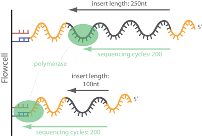
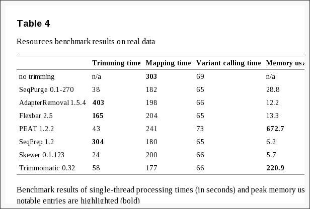

Genomes in biodiversity research
================================

Adaptor sequences
-----------------

Read data may still have **adaptor sequences** that were ligated to the fragments during
library preparation.

Clipping adaptors
-----------------

Depending on the sequencing platform, insert size, and additional services provided by 
the sequencing lab, the reads may already be sorted by adaptors (which are then clipped 
off) or you may have to do this yourself. 

Effect of adaptor clipping
--------------------------

**Sturm M, C Schroeder & P Bauer**, 2016. SeqPurge: highly-sensitive adapter trimming for 
paired-end NGS data. _BMC Bioinformatics._ **17**: 208.
doi:[10.1186/s12859-016-1069-7](http://doi.org/10.1186/s12859-016-1069-7)

There are many tools available for adaptor clipping. Some are faster than others, and they
all affect downstream analysis time differently.

Clipping primers
----------------

Quality trimming
----------------

The Phred quality of called bases is lower:

- At higher base positions in the read (i.e. near the "end")
- The first few bases
- Along homopolymers

Hence, read trimming by quality is a common procedure, for which, again, many tools are
available.

Length filtering
----------------

Taxonomic diversity: tomato relatives
-------------------------------------

Functional diversity: snake venom
---------------------------------

Spatial diversity: phytophagous insects
---------------------------------------

