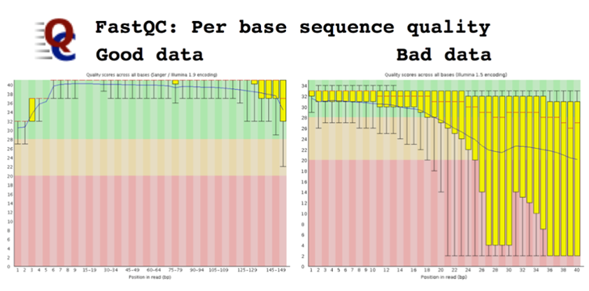
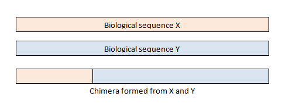
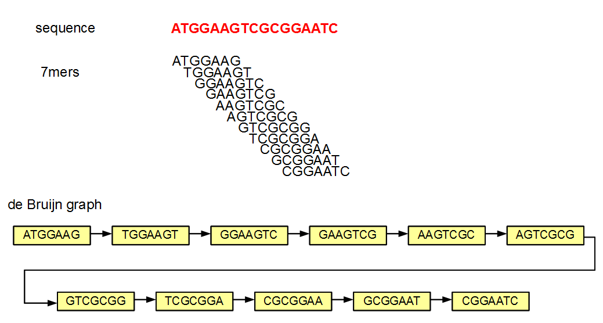

Genomes in biodiversity research
================================

Adaptor sequences
-----------------


Read data may still have **adaptor sequences** that were ligated to the fragments during
library preparation.

Clipping adaptors
-----------------


Depending on the sequencing platform, insert size, and additional services provided by 
the sequencing lab, the reads may already be sorted by adaptors (which are then clipped 
off) or you may have to do this yourself. 

Effect of adaptor clipping
--------------------------

**Sturm M, C Schroeder & P Bauer**, 2016. SeqPurge: highly-sensitive adapter trimming for 
paired-end NGS data. _BMC Bioinformatics._ **17**: 208.
doi:[10.1186/s12859-016-1069-7](http://doi.org/10.1186/s12859-016-1069-7)


There are many tools available for adaptor clipping. Some are faster than others, and they
all affect downstream analysis time differently.

Clipping primers
----------------


**Sidenote about amplicon sequencing**

- In _amplicon_ sequencing, the fragment will have been ligated with a primer as well as 
  an adaptor sequence. 
- This allows for more samples to be multiplexed because the number of combinations then 
  becomes _n adaptors_ * _n primers_ 
- And you probably don't need the amount of coverage on a single marker that a 
  non-multiplexed run would give you anyway
- However, platform vendors cannot de-multiplex automatically (because they know their
  own adaptors, but not _your_ primers), and with degenerate primers you'd have to do
  [fuzzy matching](https://github.com/naturalis/fastq-simple-tools/blob/master/script/splitfastq.pl#L128) 
  against their sequences

Quality trimming
----------------



The Phred quality of called bases is lower:

- At higher base positions in the read (i.e. near the "end")
- The first few bases
- Along homopolymers

Hence, read trimming by quality is a common procedure, for which, again, many tools are
available.

Additional filtering
--------------------



- A (crude) proxy for a read possibly being chimeric is that it occurs only once, i.e. as
  a singleton, which you might therefore filter out. This is especially the case in
  genome, but not in amplicon sequencing (because the chimera might be PCR'ed).
- On platforms that have variable length reads, you might want to filter out all reads
  below a threshold length
- When paired-end sequencing, one of the two 'ends' might be filtered out, in which case
  you might filter out the opposite end as well

Overlap-layout-consensus assembly
---------------------------------

- In _Sanger_ sequencing assembly, a 
  [graph](https://en.wikipedia.org/wiki/Graph_(discrete_mathematics)) is constructed 
  where every 
  [vertex](https://en.wikipedia.org/wiki/Vertex_(graph_theory)) is a 
  read, and 
  [edges](https://en.wikipedia.org/wiki/Edge_(graph_theory)) connect the reads that 
  overlap
- Subsequently, the [Hamiltonian path](https://en.wikipedia.org/wiki/Hamiltonian_path), 
  which visits every _vertex_ (read) exactly once is searched for, and the consensus 
  sequence along the path is computed
- However, this _overlap-layout-consensus_ approach is hard to solve (computer scientists
  call this [NP-complete](https://en.wikipedia.org/wiki/NP-completeness))


An alternative way to traverse the graph
----------------------------------------

- Computing the _Hamiltonian path_ is too computationally intensive ("NP-complete") for 
  HTS data 
- Another approach to traverse graphs is along the _Eulerian path_, where every _edge_
  (instead of vertex) is visited exactly once
- The [Eulerian path](https://en.wikipedia.org/wiki/Eulerian_path) can be traversed in 
  _linear time_ (computer scientists notate this as "_O_(|_E_|)") as opposed to 
  non-deterministic _polynomial time_ (i.e. with _n_ input _T_(_n_) = O(_n_<sup>k</sup>) 
  for some constant _k_ in [Big O notation](https://en.wikipedia.org/wiki/Big_O_notation))
- However, for this _Eulerian path_ to exist, either zero or two _vertices_ may exist with 
  odd _degree_, so the Seven Bridges of Königsberg, which Euler studied, don't form a path
  (and the overlap graph might also not)


Making the graph amenable to Eulerian traversal
-----------------------------------------------

- In a [De Bruijn graph](https://en.wikipedia.org/wiki/De_Bruijn_graph), all vertices 
  have even degree
- A _De Bruijn_ graph connects symbolic sequence data such that every vertex is a sequence
  string of length _k_ (a "_k-mer_") that is connected to other such vertices if the 
  the sequences are identical along the substring of length _k_-1, i.e. the sequences
  are shifted one step relative to one another, which creates _directedness_ in the
  graph
- The simplest cases, with binary sequence data, are shown for _k_ = 1..3 (imagine what
  this would look like for four symbols):


HTS sequence data and _k-mers_
------------------------------

- The _De Bruijn_ graph presupposes that for every _k-mer_ there are neighbours that 
  overlap with it along the substring _k-1_
- HTS read data does not naturally come out meeting that assumption: there are biases
  causing reads to overlap more irregularly
- However, the reads can be re-processed to a spectrum of substrings of some smaller 
  size _k_ that are shifted relative to one another (note that this collapses the 
  duplicates that are then created):



This re-processing can be achieved naively (there are faster tools than this) in python
thusly:

```python
def find_kmers(string, k):
    
      kmers = []
      n = len(string)

      for i in range(0, n-k+1):
           kmers.append(string[i:i+k])

      return kmers
```

Optimal _k-mer_ size
--------------------

**Chikhi R & P Medvedev**, 2014. Informed and automated k-mer size selection for genome 
assembly. _Bioinformatics_ **30**(1): 31–37 
doi:[10.1093/bioinformatics/btt310](https://doi.org/10.1093/bioinformatics/btt310)

- Smaller _k_ makes for a smaller graph, but at the cost of more duplicate _k-mers_ 
  collapsed, causing information loss and an inability to cross over repeat regions
- Higher _k_ is more memory intensive, and may increase the risk of _k-mers_ having no
  neighbours, causing short contigs
- Some tools exist that attempt to optimize this value, for example by attempting to 
  predict the value that results in the most distinct _k-mers_, which corresponds with
  certain measures of assembly quality:


Taxonomic diversity: tomato relatives
-------------------------------------

Functional diversity: snake venom
---------------------------------

Spatial diversity: phytophagous insects
---------------------------------------

