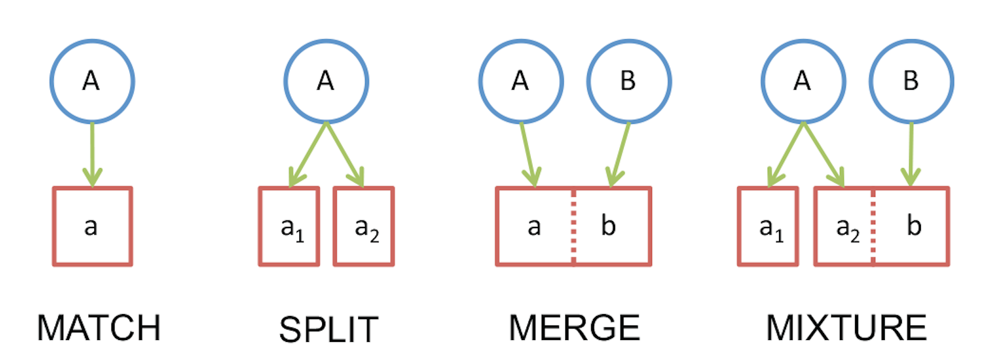

Species delimitation with DNA barcodes
======================================

Species concepts and delimitation intro
---------------------------------------

The following slide show provides an overview of species concepts and the application
of species delimitation techniques to natural history collection specimens: 

[Species delimitation - species limits and character evolution](https://www.slideshare.net/rvosa/species-delimitation-species-limits-and-character-evolution)

Barcode Index Number (BIN)
--------------------------

**Ratnasingham, S & Hebert, PDN** 2013. A DNA-Based Registry for All Animal Species: The 
Barcode Index Number (BIN) System. _PLoS ONE_ **8**(7): e66213
doi:[10.1371/journal.pone.0066213](https://doi.org/10.1371/journal.pone.0066213)
([pdf](BIN.pdf))



BIN divergence thresholds
-------------------------


Correspondence between species present in eight datasets and OTUs recognized 
through single linkage clustering with sequence divergence thresholds ranging from 
0.1–6.0%. 

- **Green** indicates the number of OTUs whose members perfectly match species
- **Yellow** shows those that merge members of two or more species
- **Orange** indicates cases where a species was split into two or more OTUs
- **Red** represents a mixture of splits and merges

BIN pipeline
------------

- HMM alignment uses a profile of the COI marker protein
- SLC connects sequences by distance, but creates 'long' graphs
- [MCL](MCL.pdf) iteratively looks for 'attractors' within the graphs and re-clusters 
  around them


Automatic Barcode Gap Discovery (ABGD)
--------------------------------------

**Puillandre N, Lambert A, Brouillet S & Achaz G** 2012. ABGD, Automatic Barcode Gap 
Discovery for primary species delimitation. _Mol Ecol._ **21**(8): 1864-77
doi:[10.1111/j.1365-294X.2011.05239.x](http://doi.org/10.1111/j.1365-294X.2011.05239.x)
([pdf](ABGD.pdf))


- **(a)** A hypothetical distribution of pairwise differences. This distribution exhibits 
  two modes. Low divergence being presumable intraspecific divergence, whereas higher
  divergence represents interspecific divergence. 
- **(b)** The same data can be represented as ranked ordered values. 
- **(c)** Slope of the ranked ordered values. There is a sudden increase in slopes in the 
  vicinity of the barcode gap. The ABGD method automatically finds the first statistically 
  significant peak in the slopes.
  
The ABGD command line tool
--------------------------

```bash
$ curl -O http://wwwabi.snv.jussieu.fr/public/abgd/last.tgz
$ tar xzvf last.tgz
$ cd Abgd
$ make
$ sudo cp abgd /usr/local/bin
```

We should now have an executable called `abgd` on the $PATH. This accepts
aligned FASTA as input, so let's analyze one of the files we have:

```bash
# inside w1d3 folder
$ mkdir Danaus_ABGD
$ abgd -o Danaus_ABGD -a Danaus.mafft.fas
```

This is all we get:

```
calculating distances 214 seq
<BR>
building newick tree for your data (it can take time when many sequences)
The matrix is not symmetric
 The matrix  is not symmetric<BR>
```

Debugging ABGD
--------------

Yikes, an error. Is there something wrong with our data? We can also input a distance
matrix, can we compute one with PHYLIP's `dnadist`? Problem:

```
WARNING: NO OVERLAP BETWEEN SEQUENCES 145 AND 200; -1.0 WAS WRITTEN
WARNING: NO OVERLAP BETWEEN SEQUENCES 145 AND 202; -1.0 WAS WRITTEN
WARNING: NO OVERLAP BETWEEN SEQUENCES 153 AND 200; -1.0 WAS WRITTEN
WARNING: NO OVERLAP BETWEEN SEQUENCES 153 AND 202; -1.0 WAS WRITTEN
WARNING: NO OVERLAP BETWEEN SEQUENCES 154 AND 200; -1.0 WAS WRITTEN
WARNING: NO OVERLAP BETWEEN SEQUENCES 154 AND 202; -1.0 WAS WRITTEN
WARNING: NO OVERLAP BETWEEN SEQUENCES 162 AND 200; -1.0 WAS WRITTEN
WARNING: NO OVERLAP BETWEEN SEQUENCES 162 AND 202; -1.0 WAS WRITTEN
WARNING: NO OVERLAP BETWEEN SEQUENCES 198 AND 200; -1.0 WAS WRITTEN
WARNING: NO OVERLAP BETWEEN SEQUENCES 198 AND 202; -1.0 WAS WRITTEN
```

In a text editor we can see that 200 and 202 are `SETIU001-1` and `SETIU032-1`.
Let's [remove](https://github.com/naturalis/mebioda/commit/681e9750b32612b59b2953a6b3a042f6c2ee47f0?diff=unified)
these. [Results](Danaus_ABGD) after trying again without those specimens:


GMYC
----

**Fujisawa T & Barraclough TG.** 2013. Delimiting Species Using Single-Locus Data and 
the Generalized Mixed Yule Coalescent Approach: A Revised Method and Evaluation on 
Simulated Data Sets _Systematic Biology_ **62**(5): 707–724 
doi:[10.1093/sysbio/syt033](https://doi.org/10.1093/sysbio/syt033) ([pdf](GMYC.pdf))


- [Tutorial](https://doi.org/10.5281/zenodo.838259)
- [Web server](http://species.h-its.org/gmyc/)

PTP
---

- [Web server](http://species.h-its.org/ptp/)

Monophyly
---------
