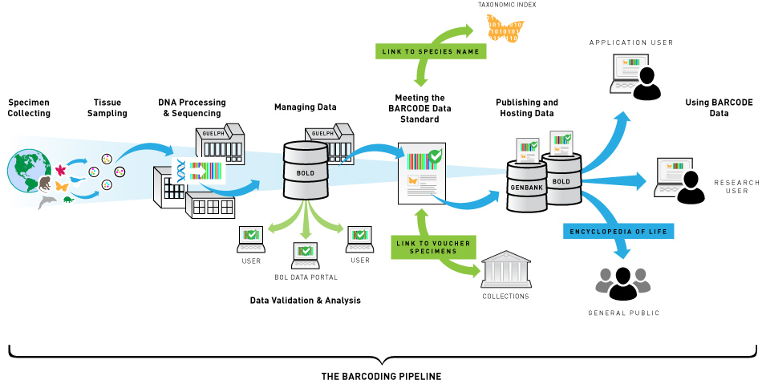
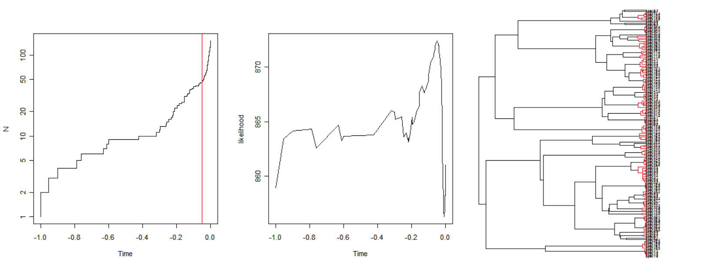
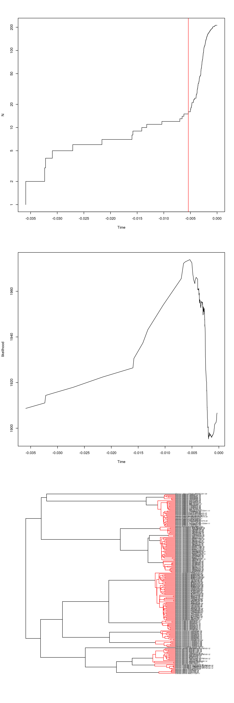
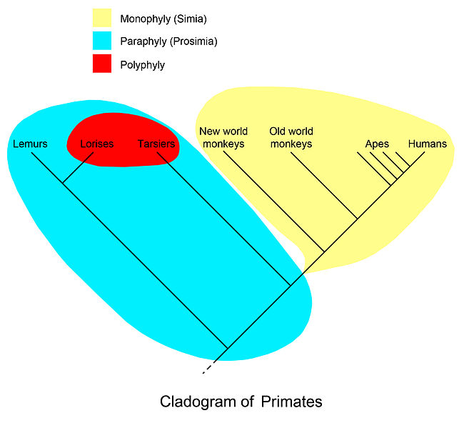

DNA barcoding and species delimitation
======================================

Barcoding
---------



Barcode Of Life Data Systems ([BOLDSYSTEMS](http://www.boldsystems.org/))
-------------------------------------------------------------------------

- Stores records about [specimens](http://www.boldsystems.org/index.php/Public_RecordView?processid=ABMC137-05)
- Includes marker sequence [data](fasta.fas), images, lat/lon coordinates, etc.
- Can query [taxonomically](http://www.boldsystems.org/index.php/Public_SearchTerms?query=Artiodactyla[tax])
  and download [all sequences](Artiodactyla.fas)
- Identification services:
  - COI for animals
  - ITS for fungi
  - rbcL and matK for plants

Species concepts and delimitation intro
---------------------------------------

The following slide show provides an overview of species concepts and the application
of species delimitation techniques to natural history collection specimens: 

[Species delimitation - species limits and character evolution](https://www.slideshare.net/rvosa/species-delimitation-species-limits-and-character-evolution)

Barcode Index Number (BIN)
--------------------------

**Ratnasingham, S & Hebert, PDN** 2013. A DNA-Based Registry for All Animal Species: The 
Barcode Index Number (BIN) System. _PLoS ONE_ **8**(7): e66213
doi:[10.1371/journal.pone.0066213](https://doi.org/10.1371/journal.pone.0066213)
([pdf](BIN.pdf))


BIN divergence thresholds
-------------------------


Correspondence between species present in eight datasets and OTUs recognized 
through single linkage clustering with sequence divergence thresholds ranging from 
0.1–6.0%. 

- **Green** indicates the number of OTUs whose members perfectly match species
- **Yellow** shows those that merge members of two or more species
- **Orange** indicates cases where a species was split into two or more OTUs
- **Red** represents a mixture of splits and merges

BIN pipeline
------------

- [HMM](https://www.ncbi.nlm.nih.gov/pubmed/20147223) alignment uses a profile of 
  the COI marker protein
- [SLC](https://en.wikipedia.org/wiki/Single-linkage_clustering) connects sequences 
  by distance, but creates 'long' graphs
- [MCL](MCL.pdf) iteratively looks for 'attractors' within the graphs and re-clusters 
  around them


Automatic Barcode Gap Discovery (ABGD)
--------------------------------------

**Puillandre N, Lambert A, Brouillet S & Achaz G** 2012. ABGD, Automatic Barcode Gap 
Discovery for primary species delimitation. _Mol Ecol._ **21**(8): 1864-77
doi:[10.1111/j.1365-294X.2011.05239.x](http://doi.org/10.1111/j.1365-294X.2011.05239.x)
([pdf](ABGD.pdf))


- **(a)** A hypothetical distribution of pairwise differences. This distribution exhibits 
  two modes. Low divergence being presumable intraspecific divergence, whereas higher
  divergence represents interspecific divergence. 
- **(b)** The same data can be represented as ranked ordered values. 
- **(c)** Slope of the ranked ordered values. There is a sudden increase in slopes in the 
  vicinity of the barcode gap. The ABGD method automatically finds the first statistically 
  significant peak in the slopes.
  
The ABGD command line tool
--------------------------

```bash
$ curl -O http://wwwabi.snv.jussieu.fr/public/abgd/last.tgz
$ tar xzvf last.tgz
$ cd Abgd
$ make
$ sudo cp abgd /usr/local/bin
```

We should now have an executable called `abgd` on the $PATH. This accepts
aligned FASTA as input, so let's analyze one of the files we have:

```bash
# inside w1d3 folder
$ mkdir Danaus_ABGD
$ abgd -o Danaus_ABGD -a Danaus.mafft.fas
```

[Resulting files](Danaus_ABGD), showing the barcode gap inflection point:


Generalized Mixed Yule Coalescent (GMYC)
-------------------------------------------------------------------

**Fujisawa T & Barraclough TG.** 2013. Delimiting Species Using Single-Locus Data and 
the Generalized Mixed Yule Coalescent Approach: A Revised Method and Evaluation on 
Simulated Data Sets _Systematic Biology_ **62**(5): 707–724 
doi:[10.1093/sysbio/syt033](https://doi.org/10.1093/sysbio/syt033) ([pdf](GMYC.pdf))

- Separate evolutionary lineages diversify according to 
  [processes](https://en.wikipedia.org/wiki/Birth%E2%80%93death_process) such as the 
  **Yule** (pure birth) model, the simplest one.
- Gene copies **coalesce** according to population genetic processes (e.g. the rate is
  proportional to the effective population size).
- The GMYC method looks for the MLE of where the coalescent process took over from the
  lineage diversification process.



The GMYC web service
--------------------

The analysis can be performed through a [web service](http://species.h-its.org/gmyc/),
and results for the [Danaus consensus tree](BEAST/Danaus.consensus.trees.nwk) in the 
following clusters:

- number of ML clusters: 13 (CI: 11-14)
- number of ML entities: 15 (CI: 13-16)

Which are distributed across the clades near the tips:



How many (using line count, [`wc -l`](http://linuxcommand.org/lc3_man_pages/wc1.html)) 
distinct taxonomic names do we have in the alignment:

```bash
$ grep '>' Danaus.mafft.fas | cut -f 1 -d '-' | sort | uniq | wc -l
      15
```

Poisson Tree Process (PTP)
--------------------------

**J Zhang, P Kapli, P Pavlidis, A Stamatakis** 2013. A general species delimitation
method with applications to phylogenetic placements. _Bioinformatics_ **29**(22): 
2869–2876 
doi:[10.1093/bioinformatics/btt499](https://doi.org/10.1093/bioinformatics/btt499)

- Is tree-based, but doesn't require ultrametric (clock-like) trees
- Uses phylogenetic distance as a proxy for substitutional difference, expecting to
  see different classes of distances produced by different Poisson processes
- Has a Bayesian implementation that produces support values for clusterings

Using the same tree as for GMYC on the [bPTP web server](http://species.h-its.org/ptp/)
obtains an [MLE of 16 species](PTP/output.PTPMLPartition.txt) with potential for (far)
greater splitting:

```
Accptance rate: 0.69020000000000004 
Merge: 49798 
Split: 50202 
Estimated number of species is between 14 and 135 
Mean: 78.03
```

Monophyly, polyphyly, paraphyly
-------------------------------

**Mutanen, M _et al._** 2016. Species-Level Para- and Polyphyly in DNA Barcode Gene 
Trees: Strong Operational Bias in European Lepidoptera, _Systematic Biology_ 
**65**(6): 1024–1040 doi:[10.1093/sysbio/syw044](https://doi.org/10.1093/sysbio/syw044)

_So how are the putative species from BoLD actually entangled?_



For each taxon:
1. Collect all tips that belong to it
2. Find the MRCA for the collected tips
3. Collect all descendants of the MRCA. If this set is identical to the set of step 1. 
   then the taxon is monophyletic and the analysis moves on to the next taxon.
4. Collect all nodes that subtend tips from the focal taxon as well as at least one other 
   taxon and sort these by their post-order index.
5. Group the collected, sorted nodes into distinct root-to-tip paths. Internal nodes that 
   are nested in each other are identified (and collected in the same group) by checking 
   that the pre-order index of the focal node is larger, and the post-order index of the 
   focal node is smaller than that of the next node in the sorted list. If there is more 
   than one distinct root-to-tip path (i.e., group), the taxon is considered polyphyletic,
   otherwise paraphyletic.
6. For each first (i.e. most recent) node in each group, collect all subtended species. 
   The union of these sets across groups forms the set of entangled species.

```bash
$ curl \
  -F "infile=@BEAST/Danaus.consensus.trees.nwk" \
  -F "format=newick" \
  -F "separator=-" \
  -F "astsv=true" \
  -F "cgi=true" \
  http://monophylizer.naturalis.nl/cgi-bin/monophylizer.pl > Danaus.monophyly.tsv
```

Which produces a [spreadsheet](Danaus.monophyly.tsv) that identifies the exact matches
(i.e. `monophyletic`) and where there is entanglement among species (i.e. `paraphyletic`
or `polyphyletic`).