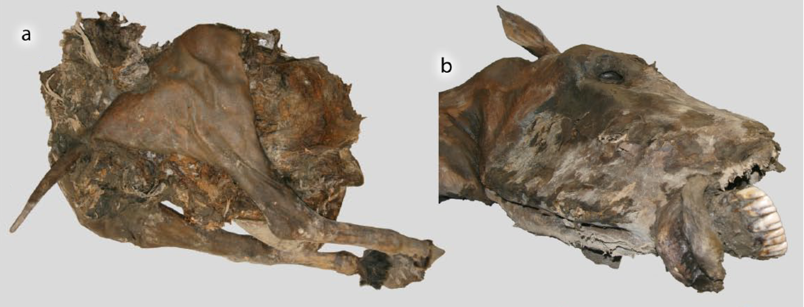

Metabarcoding
=============

Introduction
------------

Metabarcoding analysis
----------------------
General workflow
- sequence merging
- data cleaning (trimming, filtering)
- associating reads with samples
- clustering (singleton removal)
- OTU picking
- taxonomic assignment
- rarefaction
- phylogenetic diversity metrics

Data types
- reads from markers (eDNA, community DNA)
- OTU tables

Command-line tools and toolkits
- QIIME
- Mothur
- OBITools
- usearch
- BLAST

QIIME workflow
--------------
- `import` data
- demultiplex (`demux`)
- denoise
- feature table

Metabarcoding the Deepwater Horizon oil spill
---------------------------------------------

**HM Bik, KM Halanych, J Sharma & WK Thomas**. 2012. Dramatic Shifts in Benthic Microbial 
Eukaryote Communities following the Deepwater Horizon Oil Spill. _PLoS ONE_ 
**7**(6): e38550 
doi:[10.1371/journal.pone.0038550](https://doi.org/10.1371/journal.pone.0038550)

Deepwater Horizon sampling design
---------------------------------

A study using 454 data processed with the QIIME pipeline. With these data the assumption 
was that the reads are structured according to the following primer and amplicon construct:

In this case with data with the following experimental design:

- sampled over two points in time (pre- and post-spill);
- in 7 localities (Bayfront Park, Shellfish Lab, Ryan Ct, Cadillac Ave, Dauphin Bay, 
  Belleair Blvd, Grand Isle);
- sequencing two markers with two primers (F04/R22, NF1/18Sr2b) 

Oil spill impact: dramatic shifts in benthic microbial eukaryote communities
----------------------------------------------------------------------------

Accordingly, the reads were demultiplexed following 
[this complex mapping](qiime/qiime-mapping.tsv). The reads were then clustered with
[UCLUST](https://www.drive5.com/usearch/manual/uclust_algo.html) and denoised. Finally,
taxonomic identification of each cluster was performed using MegaBLAST, resulting in a
[sample by taxon table](qiime/qiime-samples.tsv) alternatively visualized as follows:

Gut contents of a permafrost horse
----------------------------------
**B Gravendeel, A Protopopov, I Bull, E Duijm, F Gill, A Nieman, N Rudaya, A N Tikhonov, 
S Trofimova, GBA van Reenen, R Vos, S Zhilich & B van Geel**. 2014. Multiproxy study of 
the last meal of a mid-Holocene Oyogos Yar horse, Sakha Republic, Russia. 
_The Holocene_ **24**(10): 1288-1296
doi:[10.1177/0959683614540953](https://doi.org/10.1177/0959683614540953)

- ancient DNA sequencing of the gut contents of a c. 5400 year old horse from Russian 
  permafrost
- two chloroplast markers (_rbcL_ and _trnL-trnF_) amplified with forward and reverse
  primers
- findings corroborated with morphological analysis

Analysis workflow:

1. demultiplex on IonTorrent adaptors; Phred quality (Q20) and length (>=100bp) filter
2. cluster reads with [CD-HIT](http://www.bioinformatics.org/cd-hit/)
3. BLAST against NCBI _nr_

_The combined data point to an open landscape of a coastal tundra dominated by graminoids
(Poaceae, Cyperaceae) with a limited amount of Birch and Alder._

Gut contents of a permafrost bison
----------------------------------

**B van Geel, A Protopopov, I Bull, E Duijm, F Gill, Y Lammers, A Nieman, N Rudaya, 
S Trofimova, A N Tikhonov, R Vos, S Zhilich, B Gravendeel**. 2014. Multiproxy diet 
analysis of the last meal of an early Holocene Yakutian bison. 
_Journal of Quaternary Science_ **29**(3): 261-268
doi:[10.1002/jqs.2698](http://doi.org/10.1002/jqs.2698)

Species detection
-----------------
**Y Lammers, T Peelen, R A Vos & B Gravendeel**. 2014. The _HTS barcode checker_ pipeline, 
a tool for automated detection of illegally traded species from high-throughput 
sequencing data. _BMC Bioinformatics_ **15**:44 
doi:[10.1186/1471-2105-15-44](https://doi.org/10.1186/1471-2105-15-44)

Adaptive management and environmental quality assessment
--------------------------------------------------------

Phylogenetic placement algorithms
---------------------------------