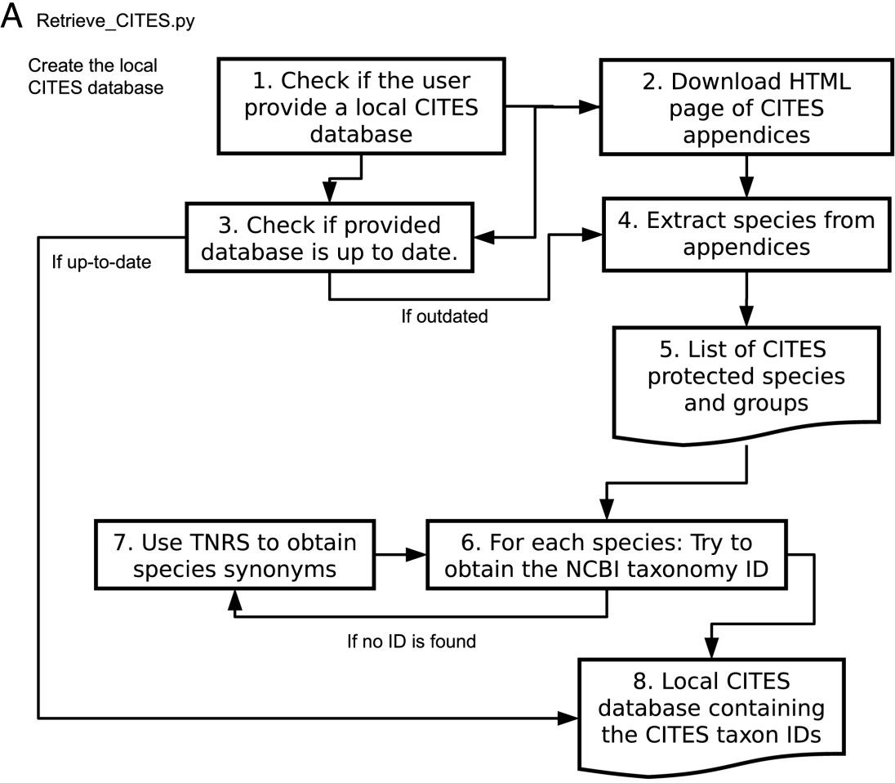
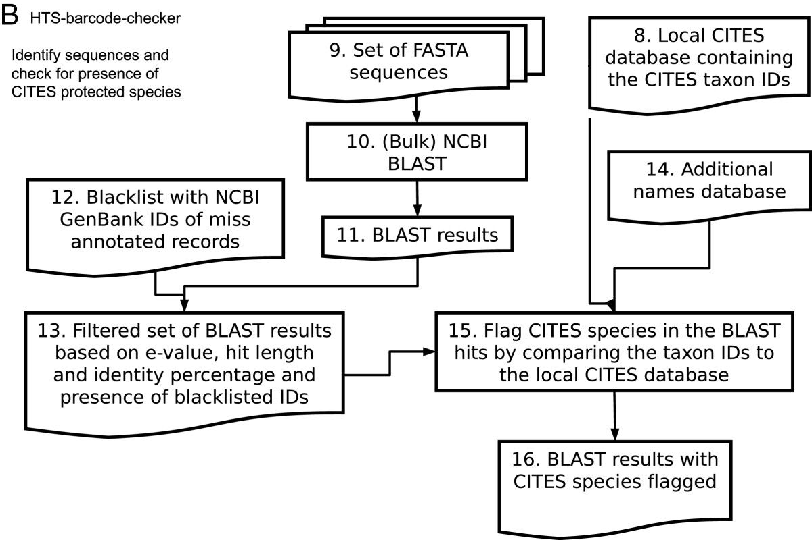
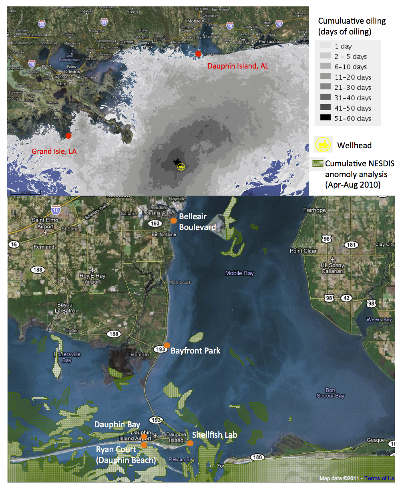

Metabarcoding
=============

General workflow of metabarcoding assays
----------------------------------------


- **sequence pre-processing**, e.g. de-replication, filtering low-quality and overly 
  short reads, trimming low-quality ends, merging pairs. Using generic 
  [HTS tools](../w1d2/lecture1.md).
- **demultiplexing**, e.g. to split by sampling locations and/or times. Done, for example,
  with [QIIME](http://qiime.org/), [OBITools](https://git.metabarcoding.org/obitools/obitools/wikis/home)
  or [mothur](https://www.mothur.org/)
- **clustering** using tools such as [CD-HIT](http://www.bioinformatics.org/cd-hit/),
  [UCLUST](https://www.drive5.com/usearch/manual/uclust_algo.html), or
  [OCTUPUS](http://octupus.sourceforge.net/)
- **outlier detection**, e.g. chimeric sequences or singletons
- **taxonomic assignment**, e.g. by [BLAST](https://blast.ncbi.nlm.nih.gov/Blast.cgi) 
  searches against reference databases, or with [usearch](https://www.drive5.com/usearch/)
  or [vsearch](https://github.com/torognes/vsearch)
- **phylogenetic analysis**, e.g. phylogenetic placement, computation of diversity metrics
- **comparing treatments**, e.g. by rarefaction of OTU tables

Species identification of gut contents of permafrost grazers
------------------------------------------------------------

- ancient DNA sequencing of the gut contents of permafrost grazers
- two chloroplast markers (_rbcL_ and _trnL-trnF_) amplified with forward and reverse
  primers
- findings corroborated with morphological analysis of macroremains and pollen

Analysis workflow:

1. demultiplex on IonTorrent adaptors; Phred quality (Q20) and length (>=100bp) filter
2. cluster reads with [CD-HIT](http://www.bioinformatics.org/cd-hit/)
3. BLAST against NCBI _nr_

Mid-Holocene horse
------------------

**B Gravendeel, A Protopopov, I Bull, E Duijm, F Gill, A Nieman, N Rudaya, A N Tikhonov, 
S Trofimova, GBA van Reenen, R Vos, S Zhilich & B van Geel**. 2014. Multiproxy study of 
the last meal of a mid-Holocene Oyogos Yar horse, Sakha Republic, Russia. 
_The Holocene_ **24**(10): 1288-1296
doi:[10.1177/0959683614540953](https://doi.org/10.1177/0959683614540953)

- c. 5,400 years ago, [Oyogos Yar](https://goo.gl/maps/jyEBfYaKEgn), Russia
- Pollen grains and the aDNA record give information about taxa that occurred in the 
  landscape. 
- The combined data point to an open landscape of a coastal tundra dominated by 
  graminoids (Poaceae, Cyperaceae) with a limited amount of Birch and Alder.


Early Holocene Yakutian bison
-----------------------------

**B van Geel, A Protopopov, I Bull, E Duijm, F Gill, Y Lammers, A Nieman, N Rudaya, 
S Trofimova, A N Tikhonov, R Vos, S Zhilich, B Gravendeel**. 2014. Multiproxy diet 
analysis of the last meal of an early Holocene Yakutian bison. 
_Journal of Quaternary Science_ **29**(3): 261-268
doi:[10.1002/jqs.2698](http://doi.org/10.1002/jqs.2698)

- c. 10,500 years ago, [Chuckchalakh lake](https://goo.gl/maps/ykG5NpsFceS2), Russia
- Remains of shrubs (_Alnus_, _Betula_, _Salix_) and Poaceae indicate that the animal 
  probably lived in a landscape of predominantly dry soils, intermixed with wetlands 
  containing herbaceous plant species, as indicated by remains of _Comarum palustre_, 
  _Caltha palustris_, _Eriophorum_, _Sparganium_, _Menyanthes trifoliata_ and 
  _Utricularia_.
- All recorded taxa still occur in the present-day Yakutian tundra vegetation. 


Joining CITES listing with species detection in organic mixtures
----------------------------------------------------------------

**Y Lammers, T Peelen, R A Vos & B Gravendeel**. 2014. The _HTS barcode checker_ pipeline, 
a tool for automated detection of illegally traded species from high-throughput 
sequencing data. _BMC Bioinformatics_ **15**:44 
doi:[10.1186/1471-2105-15-44](https://doi.org/10.1186/1471-2105-15-44)

First, species from the [CITES appendices](https://www.cites.org/) are joined with the 
species in the [NCBI taxonomy](https://www.ncbi.nlm.nih.gov/taxonomy) using the 
[GlobalNames taxonomic name resolution service](http://resolver.globalnames.org/api).
A simple request to this service would be:

```bash
curl -o globalnames.json http://resolver.globalnames.org/name_resolvers.json?names=Homo+sapiens
```

Which results in a large [JSON file](globalnames.json). In a script, you might process 
such data as follows:

```python
# doing a single request to the globalnames service
# usage: tnrs.py 'Homo sapiens'
import requests, sys
try:
	url = 'http://resolver.globalnames.org/name_resolvers.json'
	response = requests.get(url, params={'names':sys.argv[1]}, allow_redirects=True)
	json = response.json()
except:
	json = []

if 'results' in json['data'][0].keys():
	if 'name_string' in json['data'][0]['results'][0].keys():
		for data_dict in json['data']:
			for results_dict in data_dict['results']:
				if results_dict['data_source_title'] == 'NCBI':
					print( results_dict['taxon_id'] )					
```

Using this logic, a file-based database is populated:



Querying the CITES-annotated reference database
-----------------------------------------------



Comparing treatments: metabarcoding the Deepwater Horizon oil spill
-------------------------------------------------------------------


**HM Bik, KM Halanych, J Sharma & WK Thomas**. 2012. Dramatic Shifts in Benthic Microbial 
Eukaryote Communities following the Deepwater Horizon Oil Spill. _PLoS ONE_ 
**7**(6): e38550 
doi:[10.1371/journal.pone.0038550](https://doi.org/10.1371/journal.pone.0038550)

Deepwater Horizon sampling design
---------------------------------

A study using 454 data processed with the QIIME pipeline. With these data the assumption 
was that the reads are structured according to the following primer and amplicon construct:


In this case with data with the following experimental design:

- sampled over two points in time (pre- and post-spill);
- in 7 localities (Bayfront Park, Shellfish Lab, Ryan Ct, Cadillac Ave, Dauphin Bay, 
  Belleair Blvd, Grand Isle), mostly in the vicinity of 
  [Mobile, Alabama](https://goo.gl/maps/3XgxRk9P1Wk)
- sequencing two markers 
  ([regions of the 18 S gene](https://en.wikipedia.org/wiki/18S_ribosomal_RNA)) with two 
  primers (respectively F04/R22, NF1/18Sr2b) 




Oil spill impact: dramatic shifts in benthic microbial eukaryote communities
----------------------------------------------------------------------------

Accordingly, the reads were demultiplexed following 
[this complex mapping](qiime/qiime-mapping.tsv). The reads were then clustered with
[UCLUST](https://www.drive5.com/usearch/manual/uclust_algo.html) and denoised. Finally,
taxonomic identification of each cluster was performed using MegaBLAST, resulting in a
[sample by taxon table](qiime/qiime-samples.tsv) alternatively visualized as follows:


Phylogenetic placement
----------------------

