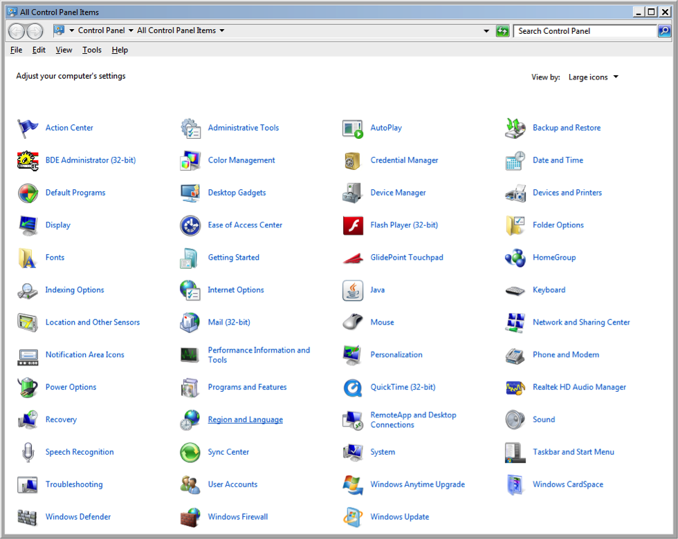
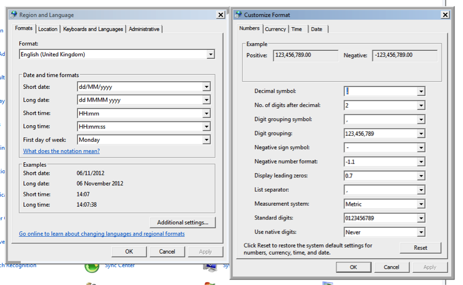
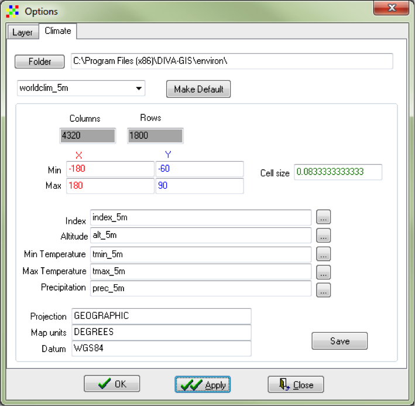
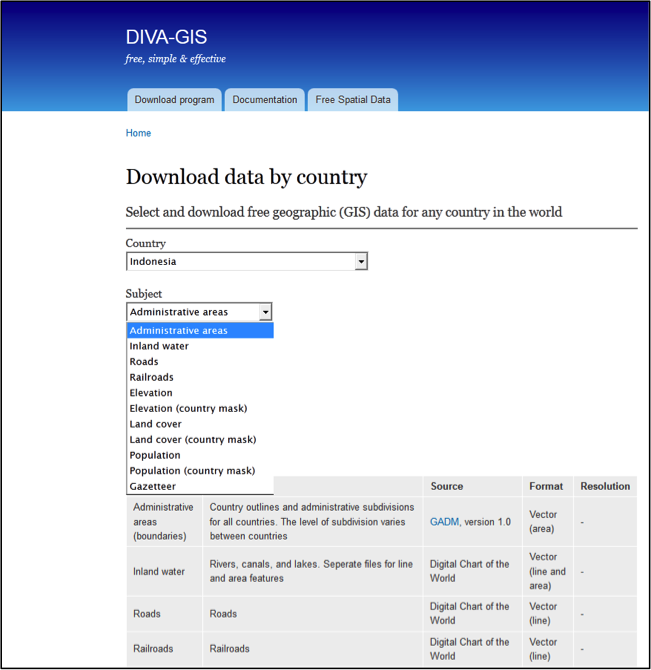
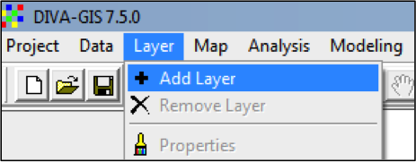
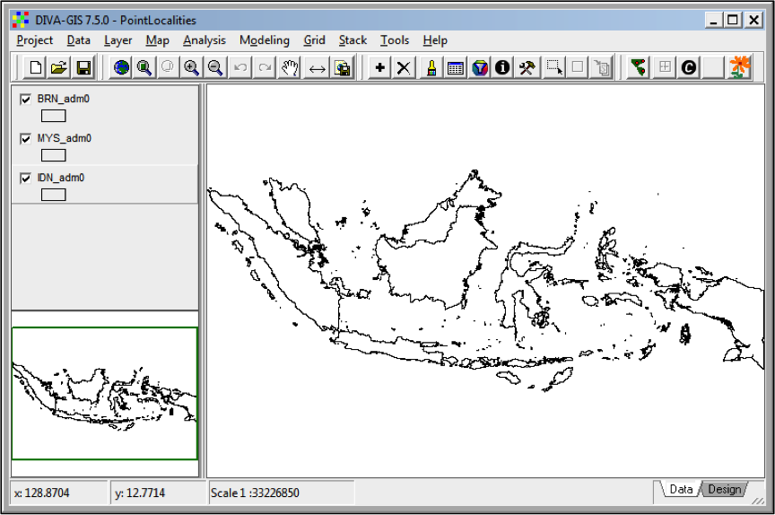
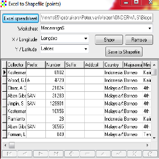
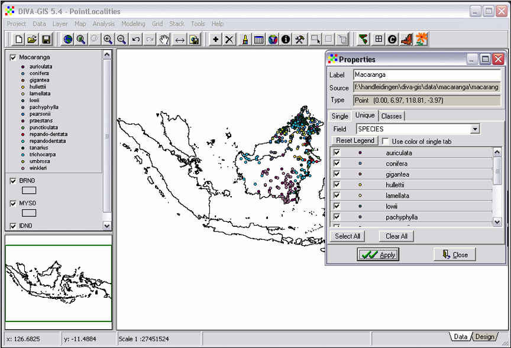

GIS and spatial modelling
=========================
Before we start working with GIS and develop species distribution models (SDMs) it is important that your PC is configured to deal with 
international data conventions. Many PCs and laptops have Dutch settings, which are different from international conventions; i.e. in 
Dutch the decimal separator is a comma instead of a point (0,23 vs. 0.23). Additionally, a *.csv (comma separated value) file in Dutch 
uses a semi-colon as record separator, where many applications expect a comma (as the name suggests!).

To ensure that your Windows computer has the correct settings you have to check the 'Region and Language' settings of your PC. 
Go to → Control Panel → Region and Language (Fig. a).

**Figure a. Control Panel with ‘Region and Language’ indicated in the red box.**

If you set the Region and Language → Format to 'English (United Kingdom)', or you adjust the 'Additional settings...' for 
'Decimal symbol', 'Digit grouping symbol', and 'List separator' (Fig. b) most applications should run correctly.

**Figure b. Region and Language settings and Customize format in the Control Panel.**

1 Creating point locality maps with DIVA-GIS
----------------------------------------------
### Developing a base map with country boundaries

1. Download DIVA-GIS from http://www.diva-gis.org/. For full functionality also download the climate data 
   http://www.diva-gis.org/climate.htm. As an optimal trade-off between functionality and resolution it is suggested to use the 
   5 arc-minutes dataset. This is approximately 9.3 × 9.3 km resolution at the equator. Extract the environmental data to the 
   folder 'environ' in the DIVA-GIS program folder (E.g. `C:\Program Files (x86)\DIVA-GIS\environ\` on Windows).
2. Check whether the environmental data are available by opening the DIVA-GIS menu option Tools → Options → tab 'Climate' → navigate 
   to environ folder → Make default → restart DIVA-GIS. **NOTE:** To save information on `C:\` requires administrator rights on your    
   PC. You can achieve this by right click on diva.exe or the DIVA-GIS shortcut and choose 'run as administrator' (saving on other 
   discs in other directories works as well).
   
   
   
   **Figure 1. Options dialog window; climate tab.**
   
3. Download administrative data such as country boundaries, rivers, roads, etc. These data are freely available at 
   http://www.diva-gis.org/gdata. 
   Several data portals provide free GIS data, e.g. http://freegisdata.rtwilson.com/, http://www.fao.org/geonetwork/srv/en/main.home, 
   http://geonetwork.grid.unep.ch/geonetwork/srv/en/main.home or http://www.gadm.org/. Download the Administrative areas for Indonesia,
   Malaysia and Brunei Darussalam.
   
   
   
   **Figure 2. Snapshot from gData website - http://www.diva-gis.org/gdata.**
   
4. Extract the zip files.
5. Add the vector shape files. Open menu-option Layer → Add layer → select the level IDN0 file. Repeat this action for the MYS0 
   and BRN0 files. (Alternatively, download all country boundaries via http://biogeo.ucdavis.edu/data/world/countries_shp.zip).
   
   
   
   **Figure 3. Add a layer to you GIS project. Left: menu-option, right: toolbar button.**
   
6. You can change the order of the layers by dragging and dropping the layers in the left panel. 
7. Right-click one of the layers and choose 'Add to overview map' to get the spatial overview in the lower left corner (Fig. 4).

   
   
   **Figure 4. DIVA-GIS project with 3 shapefile layers. The lower left corner shows the overview.**
   
8. Save the project as PointLocalities.div

### Add collections as point file

One of the most straightforward uses of a GIS is to visualize geographic data. Here we are going to add collection localities 
of records of the plant genus _Macaranga_ to the island Borneo. In order to display the collection records they need to be 
georeferenced, or supplied with geographical coordinates. Coordinates are found in different formats such as degrees-minutes-seconds, 
degrees-decimal minutes, or decimal degrees. The required GIS format is decimal degrees because this requires only one number 
for both latitude and longitude (instead of 2 or 3). You can find the coordinates of most localities in printed and/or online 
gazetteers:

- La Tierra gazetteer - http://www.tutiempo.net/Tierra/.
- NGA GEOnet Names Server (GNS) - http://geonames.nga.mil/gns/html/.
- Google Earth and Maps - https://maps.google.com/.
- Fuzzy Gazetteer - http://isodp.hof-university.de/fuzzyg/query/.

If you only have coordinates in degrees-minutes-seconds you can convert them to decimal degrees with an online tool provided 
by Directions Magazine - http://www.directionsmag.com/site/latlong-converter/. It is easiest to prepare your species file in 
a spreadsheet programme like MS Excel or Open Office Calculator. Another option is to directly export from a database query.

1. Open the file Macaranga.xls
2. DIVA-GIS can open Excel 97-2003 .xls files (not Excel 2010 or .xlsx files). Thus save as Excel 97-2003 (.xls) if necessary.
3. Open menu option Data → Import Points to Shapefile → From Excel (.XLS) (Figs. 5 & 6). Press button 'Excel spreadsheet' and 
   navigate to the file location. Take care that the fields longitude and latitude are identified correctly. Save to Shapefile 
   (e.g. Macaranga.shp). This takes some time. Close file when finished.
   
   
   
   **Figure 5. Import points to Shapefile.**
   
   
   
   **Figure 6. Create Shapefile from Excel.xls File.**
   
4. Double-click the Macaranga layer in the left panel to open the properties panel. Activate the tab 'Unique' → select the Field 
   'SPECIES' → click the 'Reset Legend' button (Fig. 7) → Apply. You can also use the toolbar button in the red circle to open 
   the properties panel.
   
   
   
   **Figure 7. Change the properties of a layer.**
   
5. Click the circle symbol of one of the species in the properties panel to change the type of symbol, size, colour, etc. If you 
   want a special symbol then select character and choose a special font (i.e. ESRI ArcView Cartography 
   http://www.creamundo.com/es/e/5).

### Print image

1. To make a printable image it is first required to zoom to desired extent. In this case to the island of Borneo. Select the 
   Macaranga-layer and click the button 'Zoom To Theme' on the toolbar. Experiment with this toolbar, i.e. activate different 
   layers and use different buttons.
   
   
   
   **Figure 8. Zoom buttons from the toolbar.**
   
2. Click the 'Design' tab in the lower right corner of the window and click the OK-button (Fig. 9).

   
   
   **Figure 9. The ‘Design’ window, note lower right corner.**
   
3. Add a Legend, North arrow, and Scale bar. Click until the components are located at the desired position. Then delete all 
   items by clicking the 
   delete button (red cross), and add them again. The items will appear at the correct position.
4. Save the image as *.tiff using the 'Save to file' button. 

NOTE:  Additional information on DIVA-GIS can be found in the manual (http://www.diva-gis.org/docs/DIVA-GIS_manual_7.pdf).
