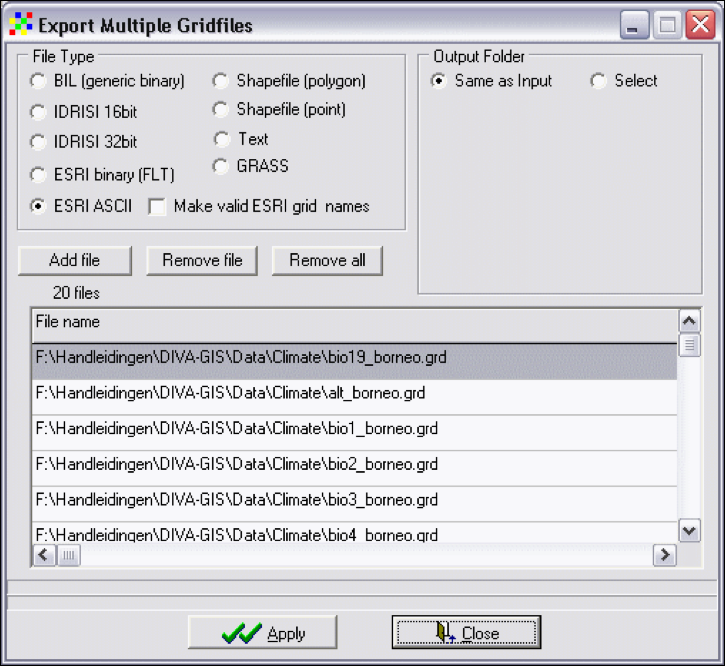

2 Preparing GIS data layers for Species Distribution Modelling
==============================================================

In order to predict the presence/absence of species for areas where never a collection was made, 
has led to the development of species distribution modelling techniques. Comprehensive comparisons 
of the different distribution modelling techniques have recently been published (Elith et al. 2006, 
Wisz et al. 2008, Aguirre-Gutiérrez et al. 2013). Species’ distribution models (SDMs) attempt to 
predict the potential distribution of species by interpolating identified relationships between 
species' presence/absence, or presence-only data on one hand, and environmental predictors on the 
other hand, to a geographical area of interest. This means that we need environmental predictors, 
related to the ecology of the modelled species, for the geographical area of interest. Here the 
island Borneo. Importantly, the spatial resolution and the geographical extent of the different 
environmental predictor data-layers must be **exactly** the same. The most widely used 
climatological data is the 'Worldclim' data set (http://www.worldclim.org). Other sources of 
spatial data are CliMond (https://www.climond.org/), CCAFS (http://ccafs-climate.org/data/).

1. Download the current climatic conditions as generic grids (raster) climate files from the 
   WorldClim database; Bioclim variables (19) and Altitude (suggested resolution is 5 arc-minutes).
2. The \*.bil/\*.hdr-files need to be converted to \*.grd/\*.gri-files. Open menu-option Data -> Import 
   to Gridfile -> Multiple Files. See figure 10 for details.
   
   
   
   **Figure 10. Import Multiple Files to Gridfiles window.**

3. The converted grid files can be added to the GIS project with the Layer -> Add Layer-option.

The next step is to cut the grid layers to the geographical extent of Borneo.

4. Select one grid-layer, e.g. alt from the left navigation panel. Open menu-option Grid -> Cut.
5. Fill in a new 'Output' file name, i.e. alt_borneo (Fig. 11).
6. Click the button 'Draw Rectangle' and select the island Borneo. You can also activate the 
   coordinates box and fill in the coordinates; X from 108 – 120 and Y from -4.5 – 8.
   
   
   
   **Figure 11. The Cut dialog window.**
   
7. Add the next layer(s), e.g. bio1. Open menu-option Grid -> Cut. Fill out a new 'Output' file 
   name. Now go to 'Copy from other gridfile' and select the alt_borneo.grd file -> Click OK.
8. Repeat point 7 for the remaining 18 layers.
9. Double-click the layers in the left panel to open their properties window. Mark the box 
   'NoData Transparent'.
10. Double-click the layers in the left panel to open their properties window. Mark the box 
    'NoData Transparent'.
    
  
    
  **Figure 12. Export Multiple Gridfiles window.**

  Before we can start modelling the species distributions we have to check whether all 
  environmental data-layers have exactly the same dimensions.

11. Open the folder with \*.asc files -> right-click on an ASCII file -> Open with -> Notepad 
    (Fig. 13).
    
  
    
  **Figure 13. Open an \*.asc file with a text editor.**
    
  All headers should have the same number of columns (ncols) and rows (nrows), the same x and y 
  coordinates (xllcorner  (= x lower left corner) and yllcorner), and the same cellsize (Fig. 14).
  
  
  
  **Figure 14. The header of an \*.asc file.**
  
  You are ready to start modelling.

### References

- Aguirre-Gutiérrez, J., L. G. Carvalheiro, C. Polce, E. E. van Loon, N. Raes, M. Reemer, and 
  J. C. Biesmeijer. 2013. Fit-for-Purpose: Species Distribution Model Performance Depends on 
  Evaluation Criteria – Dutch Hoverflies as a Case Study. PLoS ONE 8:e63708.
- Elith, J., C. H. Graham, R. P. Anderson, M. Dudik, S. Ferrier, A. Guisan, R. J. Hijmans, F. 
  Huettmann, J. R. Leathwick, A. Lehmann, J. Li, L. G. Lohmann, B. A. Loiselle, G. Manion, C. Moritz, 
  M. Nakamura, Y. Nakazawa, J. M. C. Overton, A. T. Peterson, S. J. Phillips, K. Richardson, R. 
  Scachetti-Pereira, R. E. Schapire, J. Soberon, S. Williams, M. S. Wisz, and N. E. Zimmermann. 2006. 
  Novel methods improve prediction of species' distributions from occurrence data. Ecography 
  29:129-151.
- Wisz, M. S., R. J. Hijmans, J. Li, A. T. Peterson, C. H. Graham, and A. Guisan. 2008. Effects of 
  sample size on the performance of species distribution models. Diversity and Distributions 
  14:763-773.

.

