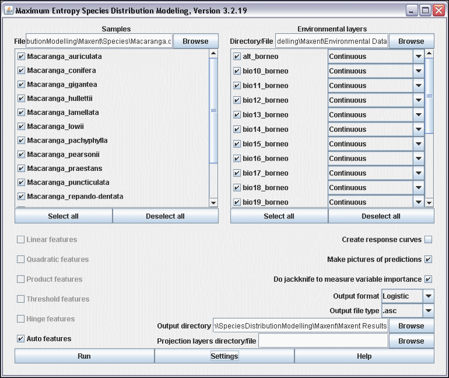
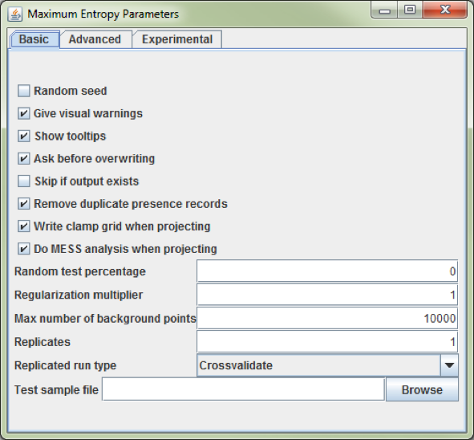
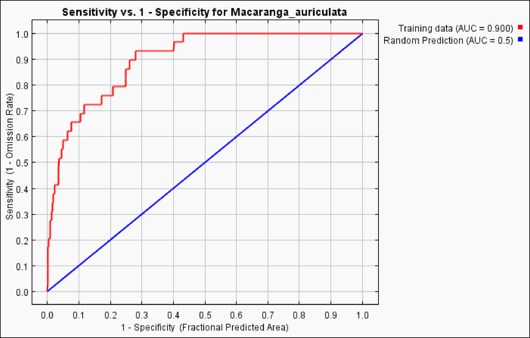
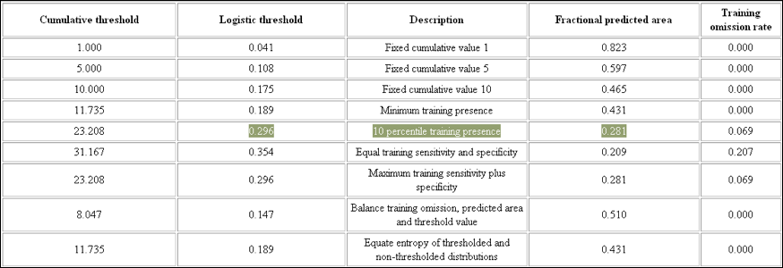
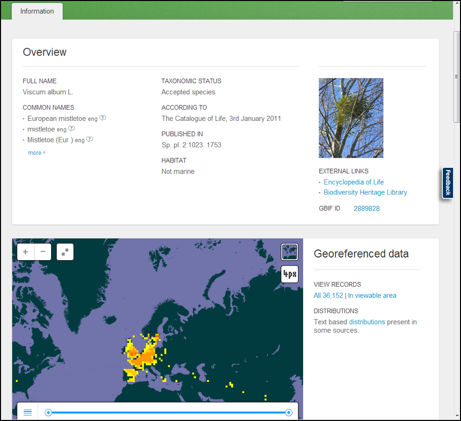

3 Species Distribution Modelling with MaxEnt
============================================

### Species Distribution Models (SDMs)

Species Distribution Models (SDMs), also known as Ecological Niche Models (ENMs), predict the 
presence and absence of species by interpolating identified relationships between collection 
data, stored in Natural History Museums and Herbaria, and environmental data. In Chapter 1 it 
was demonstrated how to prepare the collection data, and in Chapter 2 the environmental data 
were created. In this chapter we identify the relationships between species presence records 
and environmental data with a distribution modelling application, and subsequently interpolate 
the relationships to the research area of interest; here Borneo. We start with downloading the 
MaxEnt application from http://www.cs.princeton.edu/~schapire/maxent/. You can also download 
the MaxEnt tutorial from this website. Besides MaxEnt there are many other algorithms and 
applications such as GARP (http://nhm.ku.edu/desktopgarp/), BioMapper (http://www2.unil.ch/biomapper/), 
and Generalized Dissimilarity Modelling (http://www.biomaps.net.au/gdm/), amongst others! 
Most modelling algorithms are also available in R (R Development Core Team 2014). MaxEnt is a 
Java application, so you need Java to be installed on your computer (http://www.java.com). You 
open MaxEnt by clicking the Maxent.bat file (Fig. 15).

Maxent uses the maximum entropy algorithm which is defined as follows:

> MaxEnt, or the maximum entropy method for species' distribution modelling, estimates the 
> most uniform distribution ('maximum entropy') across the study area, given the constraint that 
> the expected value of each environmental predictor variable under this estimated distribution 
> matches its empirical average (average values for the set of species’ presence records) 
> (Phillips et al. 2006).

**Figure 15. Maxent 3.2.19 interface.**

1. Create a folder 'Maxent'. Within this folder you create three new folders: 'Species', 
   'Environmental Data', and 'Maxent Results'. Copy the file macaranga.csv to the folder 
   'Species', and copy your environmental data layers ([Chapter 2](../2_Data_layers)) to the 
   folder 'Environmental Data'.
2. Use the Browse buttons to select the 'Samples File', the 'Environmental layers Directory 
   File', and the 'Output directory' (Fig. 15).
3. Figure 15 shows how a batch is run in Maxent. For computational and time reasons it is 
   best to run one model at the time. Click the button 'Deselect all' of the 'Samples' box 
   and select only _Macaranga auriculata_. Make sure you uncheck the option 
   'Do jackknife to measure variable importance'.
4. Click the button 'Settings' and check the option 'Remove duplicate presence records', set 
   the 'Random test percentage' to zero, and set the 'Max number of background points' to 
   10,000 (Fig. 16). Make sure there are more background points than presence records.
   
   
   
   **Figure 16. The 'Maximum Entropy Parameter' setting dialog from Maxent.**
   
5. Click the button 'Run' and create a Maxent model for _M. auriculata_.

### Validating SDMs

The most widely applied method to validate SDMs is the Area Under the Curve (AUC) of the Receiver 
Operator Curve (ROC) (Fielding and Bell 1997, McPherson et al. 2004, Raes and ter Steege 2007). The 
advantage of the AUC value over other measures of model accuracy (i.e. Cohen’s kapa, sensitivity, 
specificity) is that it is a) threshold independent, and b) prevalence insensitive. Setting a 
threshold means that continuous MaxEnt values, running from 0-1, do not have to be converted to discrete 
presence/absence values. There are several techniques to set thresholds (Liu et al. 2005), but this 
is not required for the AUC value. 

Prevalence is the proportion of the data representing species' presence, or presences / (presences + 
absences). The fact that the AUC value is relatively insensitive to prevalence is of special relevance 
because when absences are lacking, which is often the case, they are replaced by pseudo-absences, or 
background points. A sufficiently large sample of pseudo-absences is needed to provide a reasonable 
representation of the environmental variation exhibited by the geographical area of interest, typically 
1,000-10,000 points. These large numbers of pseudo-absences automatically result in low prevalence 
values. The number of records by which a species is represented in herbaria and natural history museums 
ranges from 1 to 150-200 records. Even when a species is represented by 200 unique presence-only records 
and 1000 pseudo-absences are used, prevalence is only 16.7% (200/1200).

AUC values range from 0 to 1, with a value of 0.5 indicating model accuracy not better than random, and 
a value of 1.0 indicating perfect model fit (Fielding and Bell 1997). An AUC value can be  interpreted 
as indicating the probability that, when a presence site (site where a species is recorded as present) 
and an absence site (site where a species is recorded as absent) are drawn at random from the population, 
the presence site has a higher predicted value than the absence site (Phillips et al. 2006). SDMs with an 
AUC value of 0.7 are considered to be reliable, values over 0.8 as good.

A major drawback of using pseudo-absences instead of true absences, however, is that the maximum achievable 
AUC value indicating perfect model fit, is no longer 1, but 1-a/2 (where a is the fraction of the geographical 
area of interest covered by a species' true distribution, which typically is not known). Nevertheless, random 
prediction still corresponds to an AUC value of 0.5. Therefore, standard thresholds of AUC values indicating 
SDM accuracy (e.g. the threshold of AUC>0.7 that is often used), do NOT apply (Raes and ter Steege 2007). 
Therefore be very cautious when SDMs based on presence-only data are validated with AUC values. This problem 
can be solved by testing against a null model. This procedure is described in detail in Raes and ter Steege 
2007, but this goes beyond this practical.

6. Open the `Macaranga_auriculata.html` – file in the folder ‘Maxent Results’.
7. Check the AUC value (Fig. 17).
8. Go to the threshold table in the `Macaranga_auriculata.html` file. This table contains a list of thresholds. 
   Among the most widely used ones are: '10 percentile training presence', 'Equal training sensitivity and 
   specificity', and 'Maximum training sensitivity plus specificity'.
9. Although you have made all efforts to accurately georeference your specimens it is wise to be cautious 
   about the identification and georeferencing performed by other people. I therefore suggest to be 
   conservative and use the '10 percentile training presence' – threshold to allow 10% of your specimens to 
   fall outside the predicted area. The corresponding 'Logistic threshold' is 0.296 and results in a 
   'Fractional predicted area' of 0.281 (Fig. 18).
   
   
   
   **Figure 17. The ROC curve with the reported AUC value of 0.900 for _M. auriculata_.**
   
   
   
   **Figure 18. Commonly used thresholds.**
   
10. Open the DIVA-GIS file `PointLocalities.div`.
11. Now you will import the Maxent distribution map of _M. auriculata_ into DIVA-GIS. Open menu-option 
    'Data' -> Import to Gridfile -> Single File (N.B. if you ran a batch you choose 'Multiple Files'). 
    Select 'File type' ESRII Ascii. Make sure you uncheck the 'Save as Integer' option. Use the 'Input File' 
    button to navigate to the 'Maxent Results' folder, and import `Macaranga_auriculata.asc`.
12. Open the 'Properties' dialog by double-clicking the macaranga_auriculata layer in the left frame of 
    DIVA-GIS. Select the color scheme 'Red-Green-Blue' (Fig. 19).
    
  
    
  **Figure 19. Maxent model of_ M. auriculata_.**

13. The following step is to set a threshold. The threshold for the '10 percentile training presence' is 
    0.296. Open the menu-option 'Grid' -> Reclass. Enter an 'Output'-file name, e.g. 
    'macaranga_auriculata_10perc_threshold'. Use the   button to reduce the number of rows 
    to two. Enter in the first row 'From' 0 'To' 0.296, 'New value' 0. In the second row 'From' 0.296 
    'To' 1, 'New value' 1. Click OK.
14. Double-click the 'macaranga_auriculata_10perc_threshold' and give absence a colour red and presence 
    green (Fig. 20).
    
  
  
  **Figure 20. Thresholded Maxent model of _M. auriculata_.**

### Creating diversity patterns

15. Model a couple of other SDMs. Make a stack, menu-option 'Stack' -> Make stack. Select the thresholded 
    \*.grd files with the 'Add Grid' button. Use the 'Stack'  button to save the file. Click 'Apply'.
16. Go to menu-option 'Stack' -> Calculate. Select the stack you just made with the 'Stack' button. 
    Select the option 'sum' and click 'Apply'. There is your diversity pattern.

### Exercise: Create your own favourite species distribution model

With the instructions described above you can now develop your own species distribution model.

1. Choose your species and go to the GBIF portal gbif.org.
   
   

2. To download data you have to create an account -> Create an account -> login as user.
3. Go to the Data option and select 'Explore species'. You can select the higher taxon of interest 
   to make a pre-selection below the search bar (e.g. Mammals, Flowering Plants).
   
   

4. In the example you see the data for _Viscum album_.
   
   
   
5.	Click 'All xxx | In viewable area' – choose one option, the latter makes a pre-selection of your 
   records.
6.	Click 'Add a filter' -> 'Basis of record' -> 'Specimen' (if you want to download specimens only)  
   -> Apply -> Download; this will download your specimen records. You find your records in the 
   occurrence.txt file. Open this file in Excel (use tab as separator).
   **NOTE: Marine species are also an option, as abiotic variables you can use the Bio-ORACLE**   
   **(http://www.oracle.ugent.be/download.html) dataset (Tyberghein et al. 2012).**
7. Plot the downloaded records on a map – See [manual day 1](../1_Pointdata).
8. Clip data-layers to fit your species' distribution – See [manual day 2](../1_Data_layers).
9. Model your species' distribution.

Your report should have:

-	Your name.
-	Species name.
-	Number of collections.
-	A map with the collections of your species.
-	A map with the MaxEnt model.

### Useful links

- Download of Geographic Information Systems (GIS) data-layers: http://www.worldclim.org/download
  https://www.climond.org/
- Using the ArcMap model builder to format MaxEnt environmental layers: 
  http://biodiversityinformatics.amnh.org/index.php?section=sdm_tutotial
- ESRI fonts: http://www.creamundo.com/en  search 'esri'. 
- GBIF workshop papers: http://www.ksib.pl/enm2007/index.php?id=documents
- Google Groups Maxent: http://groups.google.com/group/Maxent 
- Manual Species Distribution Modelling AMNH: 
  http://biodiversityinformatics.amnh.org/index.php?section_id=111

### Literature

- Fielding, A. H. and J. F. Bell. 1997. A review of methods for the assessment of prediction errors 
  in conservation presence/absence models. Environmental Conservation 24:38-49.
- Liu, C., P. M. Berry, T. P. Dawson, and R. G. Pearson. 2005. Selecting thresholds of occurrence 
  in the prediction of species distributions. Ecography 28:385-393.
- McPherson, J. M., W. Jetz, and D. J. Rogers. 2004. The effects of species' range sizes on the accuracy 
  of distribution models: ecological phenomenon or statistical artefact? Journal of Applied Ecology 41:811-823.
- Phillips, S. J., R. P. Anderson, and R. E. Schapire. 2006. Maximum entropy modeling of species 
  geographic distributions. Ecological Modelling 190:231-259.
- R Development Core Team. 2014. R: A language and environment for statistical computing. R Foundation for 
  Statistical Computing, Vienna, Austria.
- Raes, N. and H. ter Steege. 2007. A null-model for significance testing of presence-only species distribution 
  models. Ecography 30:727-736.
- Tyberghein, L., H. Verbruggen, K. Pauly, C. Troupin, F. Mineur, and O. De Clerck. 2012. Bio-ORACLE: a global 
  environmental dataset for marine species distribution modelling. Global Ecology and Biogeography 21:272-281.

    

   

   

   

