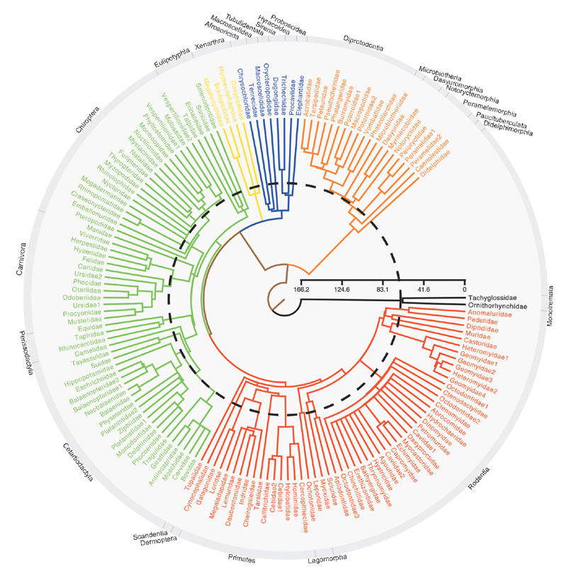

Large phylogenies in biodiversity
=================================

> - Why care about large phylogenies outside systematics?
> - Which projects synthesize large phylogenies for re-use?
> - How to use such big trees? What tooling exists?
> - (Exercise) what's the subtree for our crops?

Why care about large phylogenies outside systematics?
-----------------------------------------------------

- The distribution of splits on a tree says something about diversification 
  processes (example: LTT plot in context of GMYC species delimitation)
- The topology and branch lengths on a subtree say something about the phylogenetic
  diversity of the taxa in that subtree in comparison with other subtrees, as
  _beta_ diversity (example: UniFrac index to compare sites pre- and post-
  DeepWater Horizon spill)
- Because taxa are non-independent from one another (all life is related), their 
  characteristics cannot be analyzed as independent observations: we have to 
  consider phylogeny as a source of covariation

Large, _ad hoc_ phylogenies: Mammals
------------------------------------

**ORP Bininda-Emonds, et al.** 2007. The delayed rise of present-day mammals.
_Nature_ **446**: 507–512 
doi:[10.1038/nature05634](http://doi.org/10.1038/nature05634)

- Constructed by combining many, smaller input trees into a consensus-like 
  ("supertree") method
- Time-calibrated using molecules and fossils
- Reported result: mammals started diversifying earlier than thought
- Tree cited and re-used many times

Large, _ad hoc_ phylogenies: Birds
----------------------------------

**W Jetz, et al.** 2012. The global diversity of birds in space and time.
_Nature_ **491**: 444–448
doi:[10.1038/nature11631](http://doi.org/10.1038/nature11631)

- Constructed mostly on the basis of molecular data
- Time-calibrated using relaxed molecular clocks
- Reported result: bird diversification rates increased 50MYA
- Tree cited and re-used many times, thanks to the accompanying data 
  resource [birdtree.org](https://birdtree.org/)

Phylomatic
----------

- Phylomatic http://phylodiversity.net/phylomatic/

Taxonomic Name Resolution
-------------------------

- When integrating data sets, you will often end up trying to reconcile taxonomic names
  from different data sources
- The [taxize](https://github.com/ropensci/taxize) package allows you to scan different
  databases for name variants, common names, and higher classifications
- In this [exercise](lecture1/taxize.Rmd), compare the outputs of NCBI and ITIS

Pruning PhytoPhylo
------------------

- One way to obtain a tree for a group of interest is simply by pruning a larger tree
- The [S.PhyloMaker](https://github.com/jinyizju/S.PhyloMaker) package promises to both
  prune and graft supplied names, but it appears buggy
- However, we can use their [PhytoPhylo](lecture3/PhytoPhylo.tre) and simply extract our
  crop species
- In this [exercise](lecture1/extract.Rmd), prune the large tree and inspect the subtree
  for our taxa. What are some of the higher groups you recognize?

