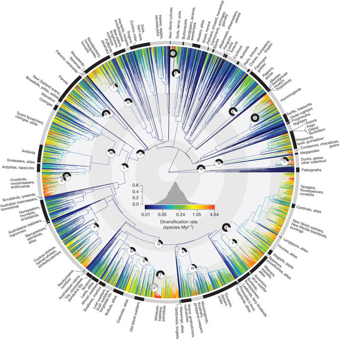
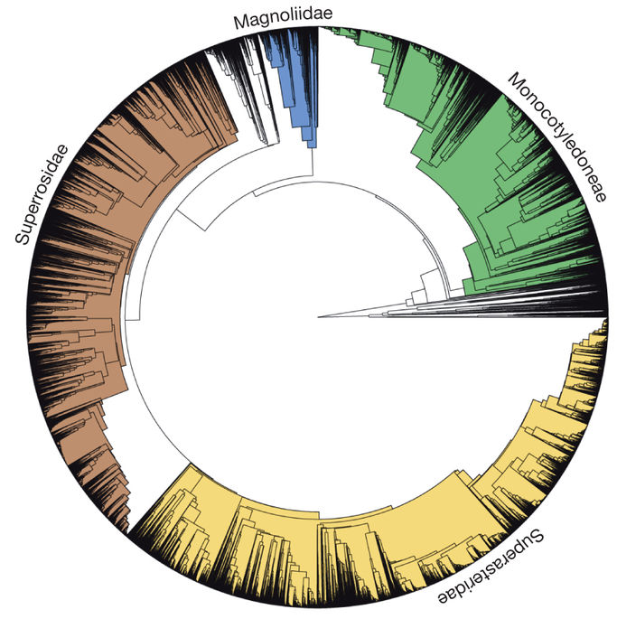
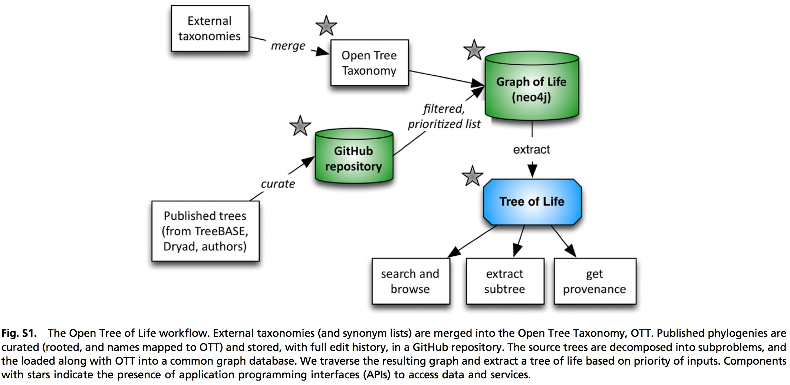
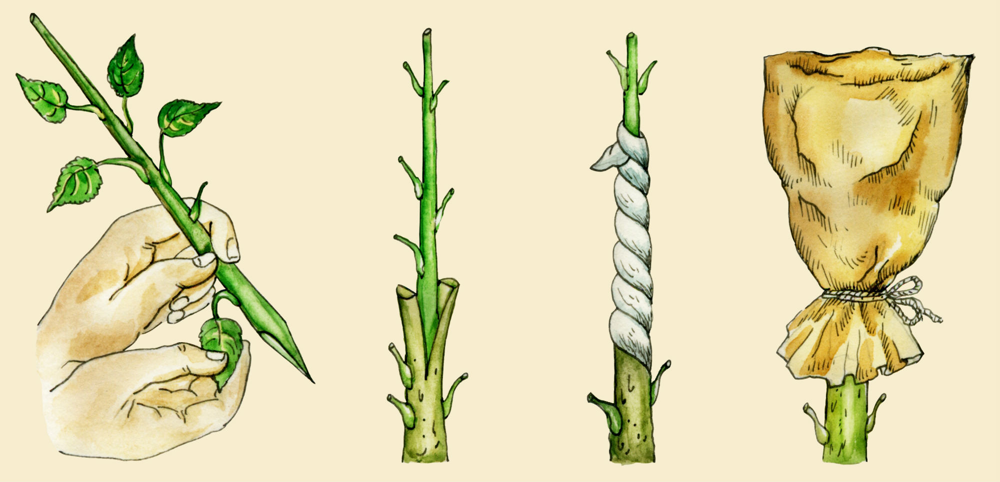

Large phylogenies in biodiversity
=================================

> - Why care about large phylogenies outside systematics?
> - Which projects synthesize large phylogenies for re-use?
> - How to use such big trees? What tooling exists?
> - (Exercise) what's the subtree for our crops?

Why care about large phylogenies outside systematics?
-----------------------------------------------------

- The distribution of splits on a tree says something about diversification 
  processes (example: LTT plot in context of GMYC species delimitation)
- The topology and branch lengths on a subtree say something about the phylogenetic
  diversity of the taxa in that subtree in comparison with other subtrees, as
  _beta_ diversity (example: UniFrac index to compare sites pre- and post-
  DeepWater Horizon spill)
- Because taxa are non-independent from one another (all life is related), their 
  characteristics cannot be analyzed as independent observations: we have to 
  consider phylogeny as a source of covariation

Large, _ad hoc_ phylogenies: Mammals
------------------------------------

**ORP Bininda-Emonds, et al.** 2007. The delayed rise of present-day mammals.
_Nature_ **446**: 507–512 
doi:[10.1038/nature05634](http://doi.org/10.1038/nature05634)

- Constructed by combining many, smaller input trees into a consensus-like 
  ("supertree") method
- Time-calibrated using molecules and fossils
- Reported result: mammals started diversifying earlier than thought
- Tree cited and re-used many times

Large, _ad hoc_ phylogenies: Birds
----------------------------------

**W Jetz, et al.** 2012. The global diversity of birds in space and time.
_Nature_ **491**: 444–448
doi:[10.1038/nature11631](http://doi.org/10.1038/nature11631)

- Constructed mostly on the basis of molecular data
- Time-calibrated using relaxed molecular clocks
- Reported result: bird diversification rates increased 50MYA
- Tree cited and re-used many times, thanks to the accompanying data 
  resource [birdtree.org](https://birdtree.org/)

Large, _ad hoc_ phylogenies: Plants
-----------------------------------

**AE Zanne, et al.** 2014. Three keys to the radiation of angiosperms into freezing 
environments. _Nature_ **506**: 89–92
doi:[10.1038/nature12872](http://doi.org/10.1038/nature12872)

- Constructed using molecular data
- Combined with trait and ecological data
- Reported result: certain traits allowed plants to colonize freezing environments

Large, ongoing, phylogenetic projects
-------------------------------------

Apart from these _ad hoc_ projects where a tree was published once, there are ongoing
initiatives to periodically release estimates of phylogeny for a given taxonomic group
and/or marker.

**Examples from molecular biodiversity:**

- [SILVA](https://www.arb-silva.de/) - curated datasets of aligned small (16S/18S, SSU) 
  and large subunit (23S/28S, LSU) ribosomal RNA (rRNA) sequences for all three domains 
  of life (Bacteria, Archaea and Eukarya).
- [GreenGenes](http://greengenes.secondgenome.com/) - curated database of small (16S) 
  subunit ribosomal near-full length sequences from the kingdoms Bacteria and Archaea.

**Examples of species tree initiatives:**

- [Tree of Life Web project](http://tolweb.org/tree/) - systematics resource where 
  clades are maintained by taxonomic experts. Hence, topology is based on the judgment
  of expert individuals.
- [Angiosperm Phylogeny working Group (APG)](http://www.mobot.org/MOBOT/research/APweb/) -
  community effort to release classifications (now at version IV) of flowering plants on 
  the basis of phylogenetic systematics.
- [Open Tree of Life](https://tree.opentreeoflife.org) - open source project to develop
  an infrastructure for building supertree-like phylogenetic estimates.

Tools to operate on large phylogenies
-------------------------------------

Given the increasing availability of large phylogenies for different taxonomic groups
there is probably a tree out there that is fairly close to the set of taxa you're 
interested in. Nonetheless, there are probably some additional steps to take when
re-using such a tree:

1. **Taxonomic name resolution** - for example, to reconcile the taxon names in the tree
   with those used in other data sets you already have (such as occurrence data, trait
   data, etc.).
2. **Pruning** - to reduce the large input tree down to the set of taxa of interest, many
   superfluous taxa may need to be pruned out of the tree.
3. **Grafting** - if a small number of taxa of interest is missing from the tree, there 
   are algorithms that can place those taxa in the tree (at least, "close enough") on the
   basis of the location of related species.

Taxonomic Name Resolution
-------------------------

When integrating data sets, you will often end up trying to reconcile taxonomic names
from different data sources. Therefore, numerous data resources have APIs that allow for
(fuzzy?) lookups of names, synonyms, alternative spellings:

| Source                                        | Docs |
|-----------------------------------------------|------|
| Encylopedia of Life                           | http://www.eol.org/api/ |
| Taxonomic Name Resolution Service             | http://www.taxosaurus.org/ |
| Integrated Taxonomic Information Service      | http://www.itis.gov/ws%5Fdescription.html |
| Global Names Resolver                         | http://resolver.globalnames.org/api |
| Global Names Index                            | https://github.com/dimus/gni/wiki/api |
| IUCN Red List                                 | https://www.assembla.com/spaces/sis/wiki/Red%5FList%5FAPI?version=3 |
| Tropicos                                      | http://services.tropicos.org/help |
| The Plant List                                | http://theplantlist.org |
| Catalogue of Life                             | http://www.catalogueoflife.org/colwebsite/content/web-services |
| National Center for Biotechnology Information | http://ncbi.nlm.nih.gov/taxonomy |
| CANADENSYS Vascan name search API             | http://data.canadensys.net/vascan/api |
| International Plant Names Index (IPNI)        | http://www.ipni.org/link%5Fto%5Fipni.html |
| Barcode of Life Data Systems (BOLD)           | http://www.boldsystems.org/index.php/Resources |
| National Biodiversity Network (UK)            | https://data.nbn.org.uk/Documentation/Web%5FServices/Web%5FServices-REST/resources/restapi/rest.html |
| Index Fungorum                                | http://www.indexfungorum.org/ixfwebservice/fungus.asmx |
| EU BON                                        | http://cybertaxonomy.eu/eubon-utis/doc.html |
| Index of Names (ION)                          | http://www.organismnames.com/ |
| Open Tree of Life (TOL)                       | https://opentreeoflife.org |
| World Register of Marine Species (WoRMS)      | http://www.marinespecies.org/aphia.php?p=webservice |
| NatureServe                                   | https://services.natureserve.org/BrowseServices/getSpeciesData/getSpeciesListREST.jsp |
| Wikipedia                                     | https://www.mediawiki.org/wiki/API:Main_page |

The [taxize](https://github.com/ropensci/taxize) package allows you to scan all these 
different databases for name variants, common names, and higher classifications.

> In this [exercise](lecture1/taxize.Rmd), compare the outputs of NCBI and ITIS

Phylomatic
----------

- Phylomatic http://phylodiversity.net/phylomatic/

Pruning PhytoPhylo
------------------

- One way to obtain a tree for a group of interest is simply by pruning a larger tree
- The [S.PhyloMaker](https://github.com/jinyizju/S.PhyloMaker) package promises to both
  prune and graft supplied names, but it appears buggy
- However, we can use their [PhytoPhylo](lecture3/PhytoPhylo.tre) and simply extract our
  crop species
- In this [exercise](lecture1/extract.Rmd), prune the large tree and inspect the subtree
  for our taxa. What are some of the higher groups you recognize?

