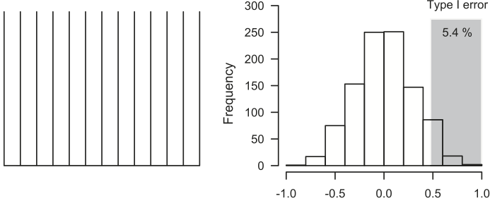
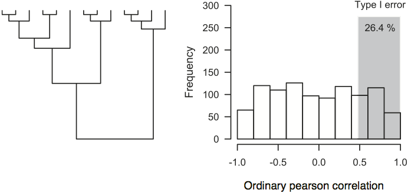

Phylogenetic comparative analysis
=================================

The problem: non-independence in comparative analysis
-----------------------------------------------------


The problem of analyzing phylogenetically structured data with conventional statistical 
methods. Ignoring phylogeny, one would conclude that X and Y are positively correlated 
([Pearson _r_](https://en.wikipedia.org/wiki/Pearson_correlation_coefficient) = 0.48, 
2-tailed _P_ = 0.034), when in fact this relationship emerges primarily from the high 
divergence in X and Y between the two clades at the root of the phylogeny.

False positives (type I error) in comparative analysis
------------------------------------------------------

Increased [type I error](https://en.wikipedia.org/wiki/Type_I_and_type_II_errors) rates 
of conventional statistics in analyses of interspecific data. When two traits evolve 
independently along a phylogeny according to Brownian motion, the probability of 
rejecting the null hypothesis of no correlation (type I error) increases with the amount 
of phylogenetic structure of the data.  



Simulations with a star phylogeny result in the error rates of 5%, which is the expected 
type I error rate if conventional (nonphylogenetic) analyses are used. 


The shaded area represents simulations where the resulting ordinary Pearson coefficient 
falls above the tabular critical value of +0.476 (11 degrees of freedom), which would 
incorrectly suggest that the two traits are correlated.



Type I error rates can be higher than 25% if the data shows a strong phylogenetic 
structure.

Brownian motion
---------------


- A hypothetical phylogeny representing the evolutionary relationships among five species,
  and its consequences at the level of phenotypic variation. Given the hierarchical 
  patterns of relatedness among species, phenotypic data in comparative studies may not 
  necessarily provide independent sources of information, as shown for the two pairs of 
  closely related species that are phenotypically very similar. 
- Consequently, patterns of phenotypic resemblance may be interpreted as evidence of 
  evolutionary convergence (adaptation) when in fact they reflect common ancestry. 
- For this particular example, phenotypic evolution proceeded as a random walk (i.e., a 
  Brownian motion model of evolution).

Brownian simulation
-------------------

Here is some code to perform discrete-time (non-phylogenetic) Brownian motion simulation:

```r
# discrete time BM simulation
n<-100; t<-100; sig2<-1/t # set parameters
time<-0:t
X<-rbind(rep(0,n),matrix(rnorm(n*t,sd=sqrt(sig2)),t,n))
Y<-apply(X,2,cumsum)
plot(time,Y[,1],ylim=range(Y),xlab="time",ylab="phenotype", type="l")
apply(Y,2,lines,x=time)
```

And here is the result:


Independent contrasts
---------------------

Calculation of phylogenetic independent contrasts for two hypothetical variables X and Y.
Contrasts estimate the amount of phenotypic divergence across sister lineages 
standardized by the amount of time they had to diverge (the square root of the sum of the 
two branches).


The algorithm runs iteratively from the tips to the root of the phylogeny, transforming 
_n_ phenotypic measurements that are not independent in _n_–1 contrast that are 
statistically independent. Because phenotypic estimates at intermediate nodes (X' and Y') 
are not measured, but inferred from the tip data, divergence times employed to calculate 
these contrasts include an additional component of variance that reflects the uncertainty 
associated with these estimates. In practice, this involves lengthening the branches 
(dashed lines) by an amount that, assuming Brownian motion, can be calculated as:

    (daughter branch length 1 × daughter branch length 2)
    ----------------------------------------------------- 
    (daughter branch length 1 + daughter branch length 2)


Contrasts results and statistical analysis
------------------------------------------

As a result, the association between the hypothetical phenotypic variables X and Y 
analyzed employing conventional statistics and independent contrasts may seem remarkably 
different. Because independent contrasts estimate phenotypic divergence after speciation 
and are expressed as deviations from zero (i.e., the daughter lineages were initially 
phenotypically identical), correlation and regression analyses employing contrasts do not 
include an intercept term and must be always calculated through the origin.


Note that the sign of each contrast is arbitrary; hence many studies have adopted the 
convention to give a positive sign to contrasts in the x-axis and invert the sign of the 
contrast in the y-axis accordingly (this procedure does not affect regression or 
correlation analyses through the origin). Even though the classic algorithm to calculate 
contrasts neglects important sources of uncertainty such as individual variation and 
measurement error, recent methods can account for these sources of error.

Phylogenetic GLS
----------------

Maximum likelihood
------------------

Bayesian
--------

Ornstein-Uhlenbeck models
-------------------------