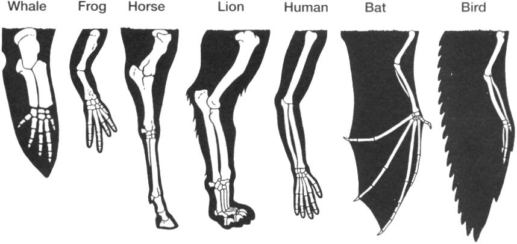
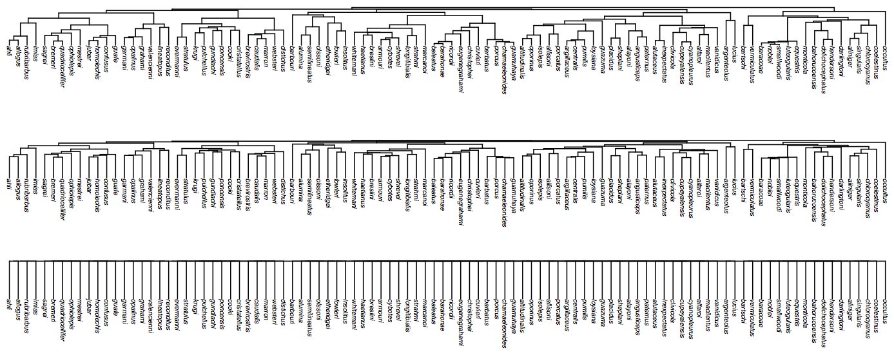
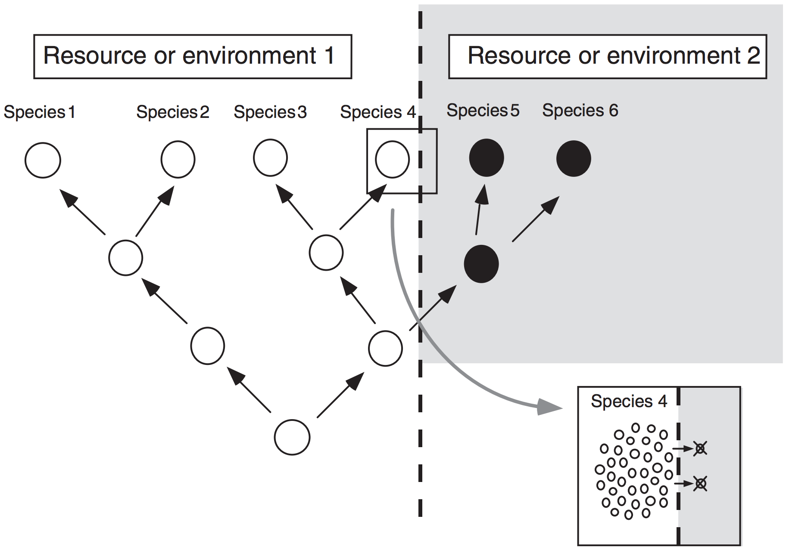
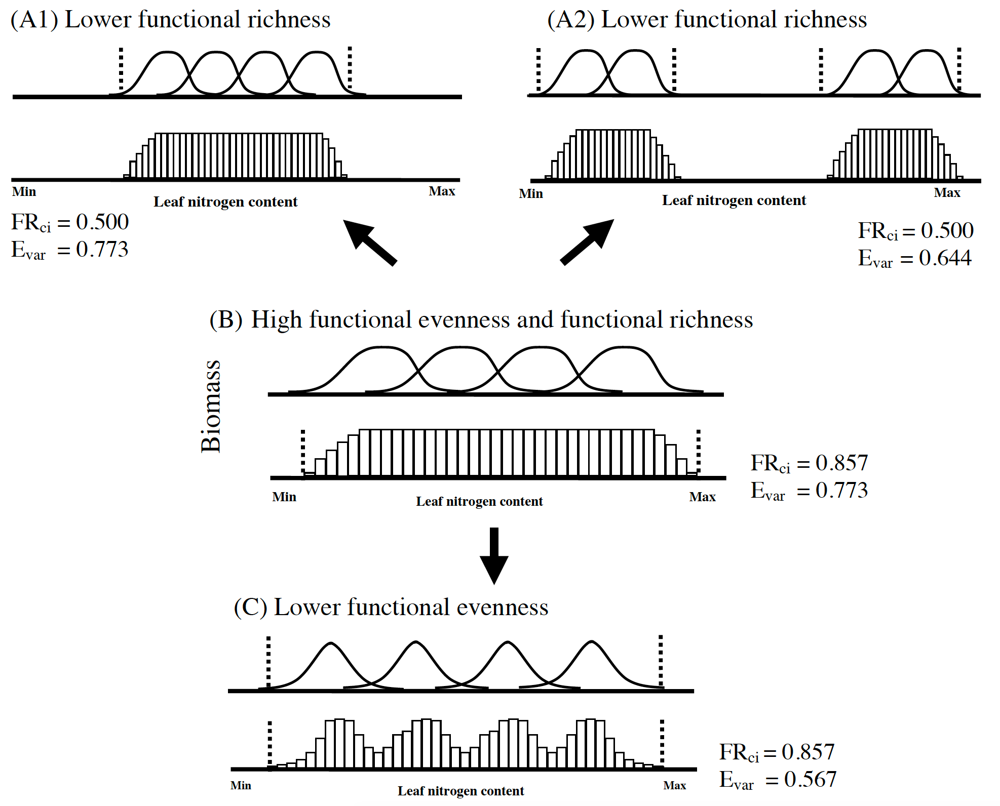

Functional diversity
====================

Characters versus traits
------------------------

A **character** applies to a feature that is homologous across species, and so the 
distribution of states follows phylogeny. A **trait** applies to ecological function with
no strong assumption of homology.

- **Characters** are expected to have less _homoplasy_ than **traits**
- Or, conversely, **characters** usually have more _phylogenetic conservatism_ than 
  **traits**
- _Synapomorphy_, _autapomorphy_ and _symplesiomorphy_ are relevant in character analysis
  but not in functional trait analysis

Phylogenetic conservatism
-------------------------

- The strength of the phylogenetic signal (or, the amount of phylogenetic conservatism) 
  can be expressed, for example, using Pagel's λ.
- The index λ is the MLE for branch length transformation that best fits the data. If
  there is no phylogenetic signal (no covariation at all), internal branches can all be 
  collapsed, corresponding with λ=0. 
- If there is strong phylogenetic signal, internal branches must not be collapsed, so the 
  MLE for λ=1.

Niche conservatism
------------------

> What is a "niche"? What's the difference between _potential_ and _realized_ niche? What
> processes maintain the dimensions of a species' niche?

**JJ Wiens et al.,** 2010. Niche conservatism as an emerging principle in ecology and 
conservation biology. _Ecology Letters_ **13**(10): 1310–1324
doi:[10.1111/j.1461-0248.2010.01515.x](http://doi.org/10.1111/j.1461-0248.2010.01515.x)

Whereas characters are selected based on the general assumption that evolutionary change
is inherently rare (i.e. "maximum parsimony"), conservatism in functional traits related
to the niche is thought to be actively maintained by natural selection.

Functional diversity of communities
-----------------------------------

**NWH Mason et al.** 2005. Functional richness, functional evenness and functional 
divergence: the primary components of functional diversity. _Oikos_ **111**(1): 112–118
doi:[10.1111/j.0030-1299.2005.13886.x](http://doi.org/10.1111/j.0030-1299.2005.13886.x)

- The vertical axes represent abundance (e.g. biomass). 
- The bell-shaped curves indicate the distribution of the abundance of individual species 
  in niche space. 
- The histograms indicate the summed abundance of the species occurring in each functional
  character category (i.e. equal-width sections of the functional character range). 
- The vertical dotted lines indicate the amount of niche space filled by the species 
  together. 
- Functional richness can decrease without a change in functional evenness if the 
  evenness of abundance within the niche space is unchanged (going from B to A1). 
- Similarly, functional evenness can decrease without a change in functional richness if 
  the amount of niche space filled is unchanged (going from B to C).

Functional trait analysis methods
=================================

Functional trait data
=====================