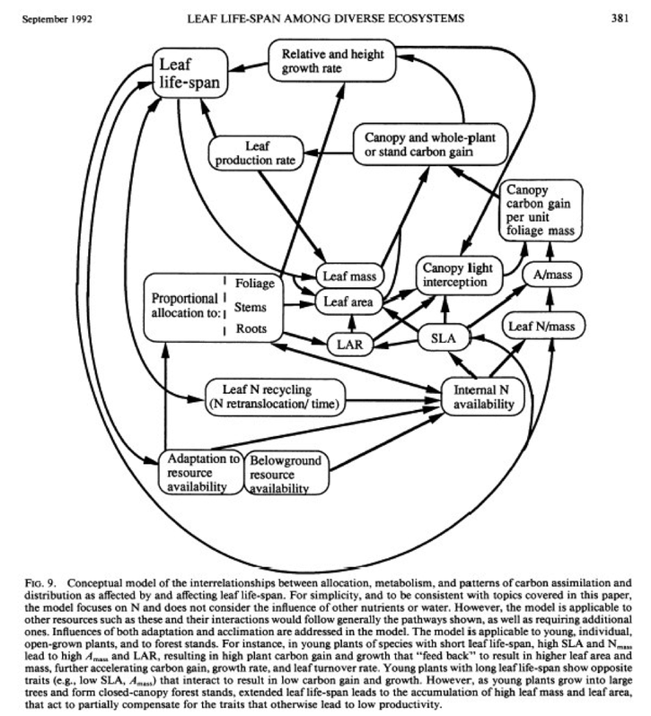
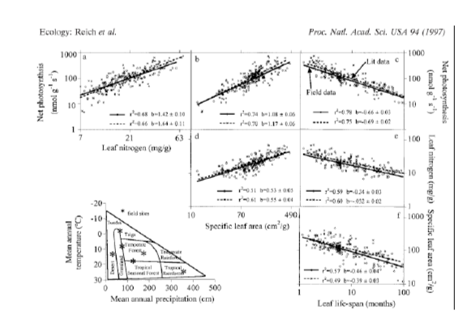
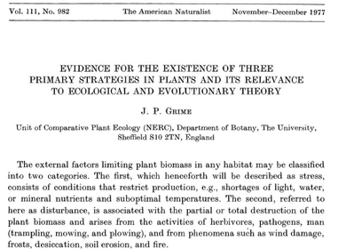
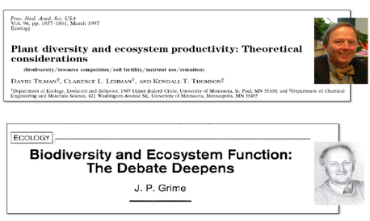
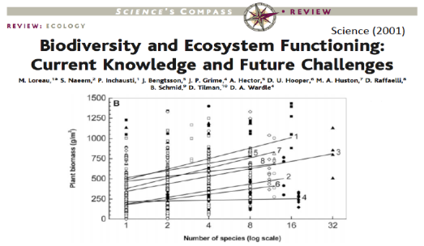
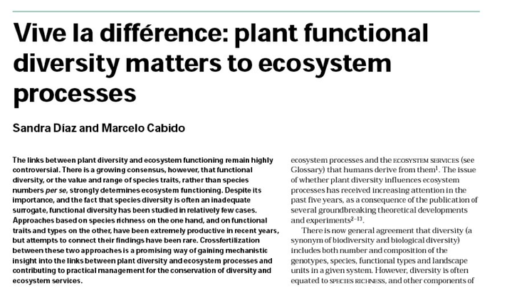
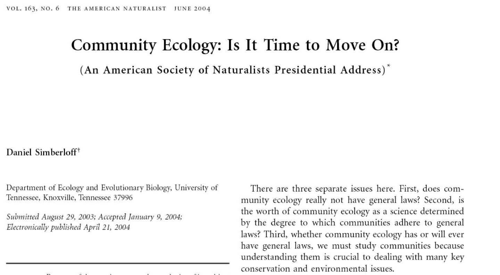
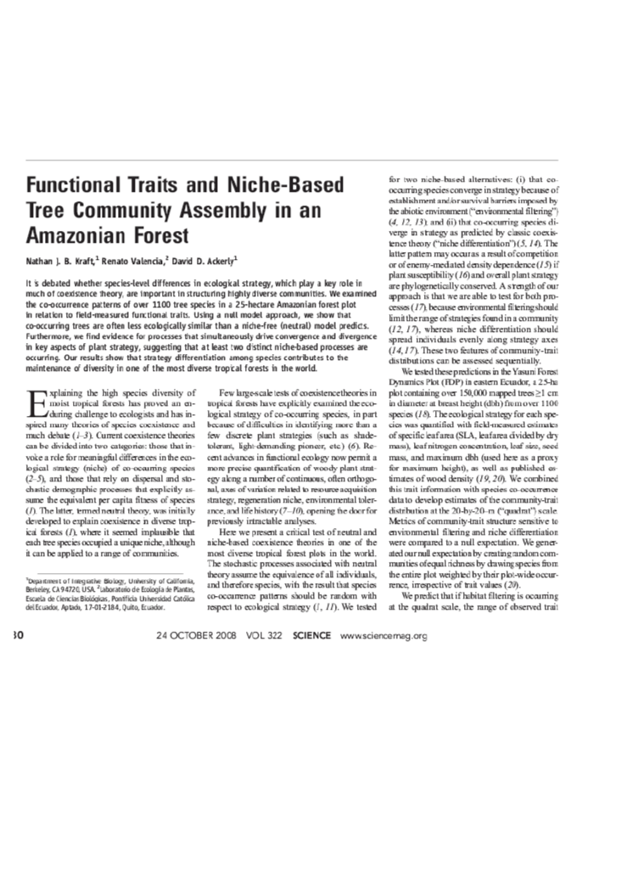

Trait data and analysis
=======================

Why trait‐based ecology?
------------------------

- **Frustrations with the limitations of 'traditional' metrics**
    - Organismal/species classification (functional groupings)
    - Life history groupings (r vs. K strategist, etc.)
    - Diversity metrics (e.g. Species diversity)
- **More closely captures variation in organismal 'performance'**
- **More quantitative (move from discrete to continuous measures)**
- **Thought to offer more insight and predictive power**
- **Can better link evolutionary questions (bridges phenotype and genotype)**
- **Can better link biodiversity and ecosystem function**
- **A basis to scale from organisms to ecosystems and evolutionary dynamics**

Why Trait‐based Science?
------------------------

**Trait‐based approaches are rapidly becoming the  basis of much ecology, physiology, 
comparative  evolutionary studies, and global change biology.**

Patterns in organismal and species functional traits are  increasingly being used to 
understand:

- evolutionary dynamics
- the mechanisms of community assembly
- ecosystem functioning,
- how the biosphere matters in global change biology

What is a trait?
----------------

There has been confusion in the use, not only of the term "trait" itself, but also in 
the underlying concept(s) it refers to.

_A trait is any quantifiable characteristic of a phenotype (organism) that is presumably 
governed by (a) specific gene(s)_

Integrated phenotypes
---------------------

- **Measuring one trait often reflects other traits and whole organism function**
- **Some traits are more 'central and important'**

Reich (1992) Ecological Monographs

The world leaf spectrum 
-----------------------

Quantifying the diversity of strategies: life histories & new insights to diversity
-----------------------------------------------------------------------------------

 | 

Quantifying the diversity of strategies: life histories & new insights to diversity
-----------------------------------------------------------------------------------

Measure traits to measure ecosystem function
--------------------------------------------

**Emerging out of the Biodiversity/Ecosystem Functioning Debate**

Science Compass Review
----------------------

"The [...] consequences of biodiversity [...] has aroused considerable interest and 
controversy. [...] there is however, uncertainty as to how (these findings) [...] 
generalize across ecosystems"

Trait diversity is more important than species richness to ecosystem functioning
--------------------------------------------------------------------------------

Revitalization of Community Ecology?
------------------------------------

"Community ecology appears to have few if any useful generalizations [...]"

New & Interesting Approaches and Methods
----------------------------------------

- New measures of diversity (Functional diversity)
- New measures of functional similarity and differences
- Models & simulations
- Hierarchical analysis of variation
- Regression techniques (OLS, RMA etc.)
- Phylogenetic methods for:
  - trait evolution 
  - measures of trait conservatism 
  - measures of rates of trait divergence
- Units, dimensional analysis, and Log transformation of traits

Exercises
---------

- [picante](http://rfunctions.blogspot.nl/2012/05/functional-diversity-fd-petchey-gaston.html)
- [FD](https://daijiang.name/en/2014/05/11/functional-diversity-in-r/)
