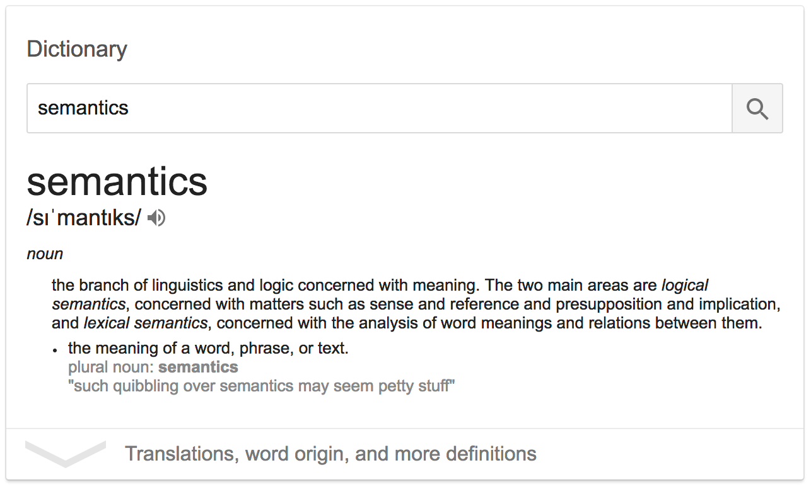
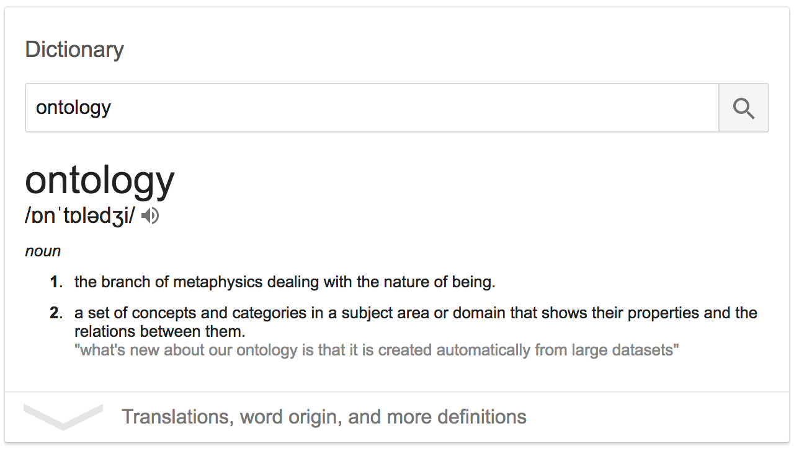
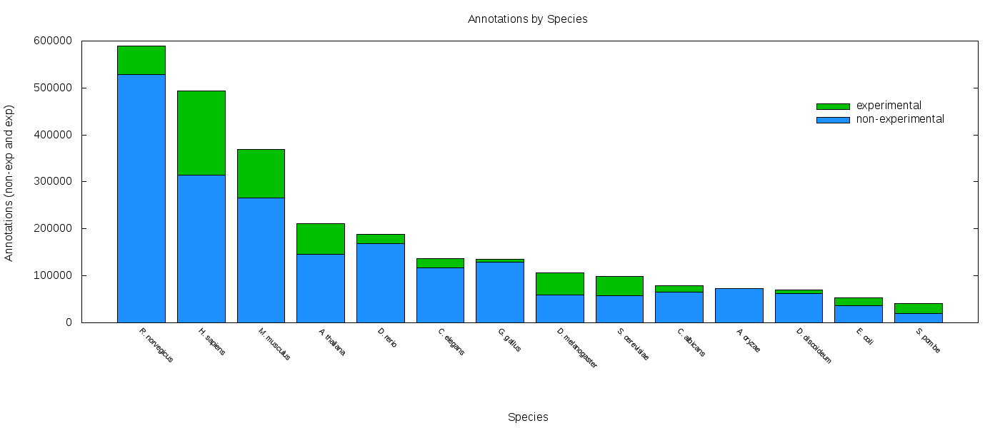
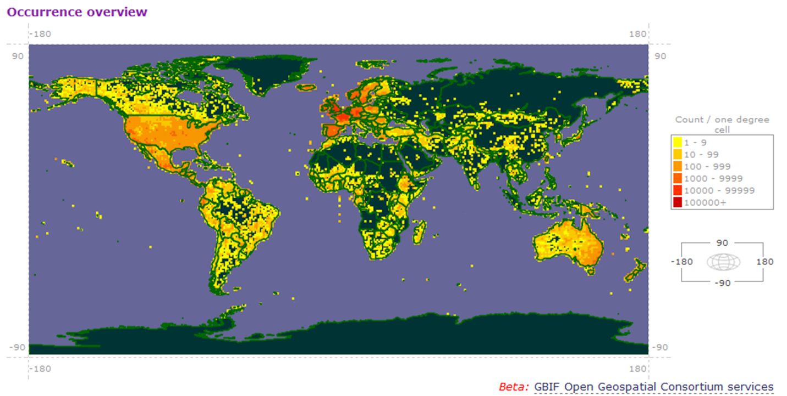

Semantics
=========

More especially: _lexical semantics_:

Examples of ambiguity in trait databases
----------------------------------------

When is the plant in bloom?

- BIEN: `plant flowering begin`
- TR8: `age_first_flowering`
- LEDA: `age_first_flowering`
- USDA: `Bloom_Period`

How much do the seeds weigh?

- BIEN: `seed mass`
- TR8: `seed_mass`, `SeedMass`, `Seed.per.Pound`
- LEDA: `seed_mass`
- USDA `Seeds_per_Pound`

The databases appear to have the same information - or close enough so that one type of
record (`Seed.per.Pound`) can be converted to another (perhaps 
`seed mass` = 1lb. / `Seed.per.pound`). However, there are at least two challenges:

1. Do we mean exactly the same? How do you define "flowering"?
2. Are the units the same? If one observation is in "imperial" (pounds and ounces) and the
   other is in "metric" we have to know this if we are going to merge data.

We have an ontological problem
------------------------------

In computer science and information science, an ontology is a formal naming and 
definition of the types, properties, and interrelationships of the entities that really 
exist in a particular domain of discourse. Thus, it is basically a **taxonomy**.

An ontology compartmentalizes the variables needed for some set of computations and 
establishes the relationships between them.

The fields of artificial intelligence, the Semantic Web, systems engineering, software 
engineering, **biomedical informatics**, library science, enterprise bookmarking, and 
information architecture all create ontologies to limit complexity and organize 
information. The ontology can then be applied to problem solving.

What are some types of ontologies?
----------------------------------

**Data-driven** ontologies have very many classes, which are (semi-)automatically generated
from activities such as expression analyses (GO) or text-mining (FLOPO):
- The [gene ontology](http://www.geneontology.org/)
- The [flora ontology](https://bioportal.bioontology.org/ontologies/FLOPO)

These types of ontologies can be used to do analyses such as
[enrichment tests](https://bioconductor.org/packages/release/bioc/html/topGO.html), which
assess whether a data set (for example, a list of genes that was expressed in a 
transcriptome) is significantly biased towards part of the ontology, such as a gene 
functional group (such as _immune response_).

Vocabularies to describe the essential concepts within a domain, such as:
- [Darwin Core](http://rs.tdwg.org/dwc/)
- The [sequence ontology (SO)](http://www.sequenceontology.org/)

Terms from such vocabularies are used to structure and annotate data. For example, the
tabular occurrence records from GBIF use Darwin Core terms as column names. GenBank
records use SO terms to label features on the sequence (such as exons, introns, CDSs).