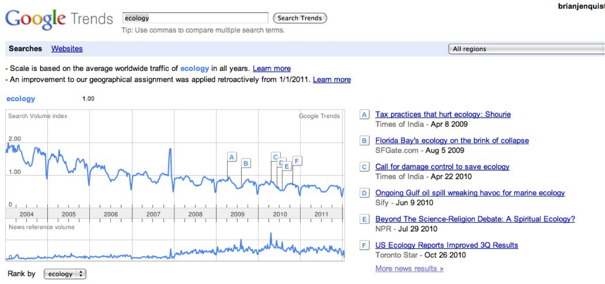
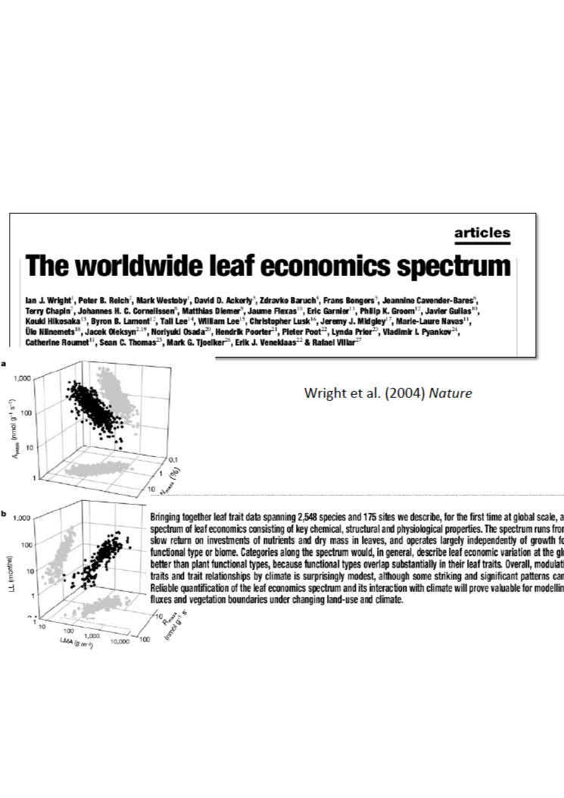
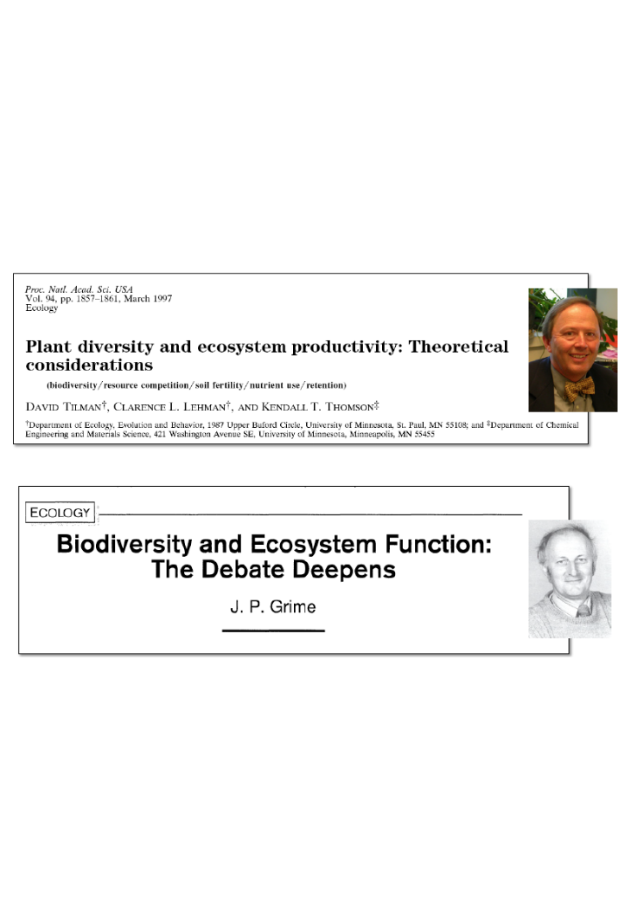
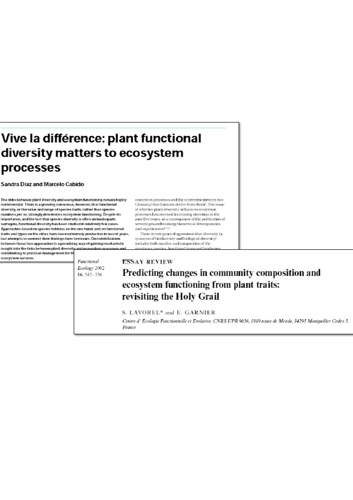

Why Trait‐based Ecology?
=============================================

Why Trait‐based Ecology?
----------------
- **Frustrations with the limitations of ‘traditional’ metrics**
    - Organismal/species classification (functional groupings)
    - Life history groupings (r vs. K strategist, etc.)
    - Diversity metrics (e.g. Species diversity)

- **More closely captures variation in organismal ‘performance’**
- **More quantitative (move from discrete to continuous measures)**

- **Thought to offer more insight and predictive power**

- **Can better link evolutionary questions (bridges phenotype and genotype)**

- **Can better link biodiversity and ecosystem function**
- **A basis to scale from organisms to ecosystems and evolutionary dynamics**

Why Trait‐based Science?
----------------

**Trait‐based approaches are rapidly becoming the  basis of much ecology, physiology, comparative  evolutionary studies, and global change biology.**
- Patterns in organismal and species functional traits are  increasingly being used to understand

   - evolutionary dynamics
   - the mechanisms of community assembly,
   - ecosystem functioning,
   - how the biosphere matters in global change biology.

Why Trait‐based Science?
----------------
**Well, we seem to just be using the word ‘trait’ more . . . .**

Why Trait‐based Science?
----------------
**. . . and seem to just be using the word ‘ecology’ less.**

Why Trait‐based Science?
----------------
Do trait based approaches really reveal more?
Improve our  science?  Provide more insight?

How much of the current focus on traits  is just hype versus real insight?

What is a Trait?
----------------
There has been confusion in the use, not only of  the term “trait” itself, but also in the underlying  concept(s) it refers to.

To start . . .
**A trait is any quantifiable characteristic of a phenotype (organism)  which is presumably is governed by a specific gene(s)**

Several uses of the term ‘Trait’
----------------
**What is a trait versus a functional trait?**

**What is a Functional Trait?**
A trait that impacts fitness indirectly via their  effects on growth, reproduction and survival,

**What is a ‘Response Trait’?**
**What is an ‘Effect Trait’?**
More on these later – but terms used in community and ecosystem ecology

An overview of some of the focal areas of  current trait based research
----------------

Integrated phenotypes
----------------
**Measuring one trait often reflects other traits and whole organism function**

**Some traits are more ‘central and important’**

Reich (1992) Ecological Monographs

The world leaf spectrum 
----------------

Quantifying the diversity of strategies: life histories & new insights to diversity
----------------

Measure traits to measure Ecosystem function
----------------
**Emerging out of the Biodiversity/Ecosystem Functioning Debate…**

Science Compass Review
----------------

“The . . . consequences of biodiversity . . has aroused considerable interest and  controversy. . . . there is however, uncertainty as to how (these findings). . . generalize  across ecosystems”

Trait diversity is more important than species richness to ecosystem functioning
----------------

Revitalization of Community Ecology?
----------------

“Community ecology appears to have few if any  useful generalizations . . . “

! 

New & Interesting Approaches and Methods
----------------
- New measures of diversity (Functional diversity)
- New measures of func1onal similarity and differences
-  models & simulaIons
- Hierarchical analysis of varia1on
- Regression techniques (OLS, RMA etc.)
- Phylogene1c methods for trait evolu1on  measures of trait conservaIsm  measures of rates of trait divergence
- Units, dimensional analysis, and Log transforma1on of traits
- Several others too! …

Phylocom
----------------
Software for the Analysis of Phylogenetic Community Structure and Chatacter Evolution with Phylomatic
Current version: 4.2 (released 2011-08-06)
© 2011-2017 Campbell Webb, David Ackerly, Steven Kembel

Features (Current version 4.2)

- Calculate phylogenetic community structure metrics ( Webb 's NRI, NTI, Faith's PD, Rao 's entropy) and compare observed patterns to those expected under various null models of community assembly and phylogeny structure (comstruct). Now, many metrics incorpora variation in taxon abundance.
- Calculate inter-sample phylogenetic distance for phylogenetic ordination and classification (comdist and comdist nt ). Now incorporates null model testing  of observed patterns.
- Comparative methods for the analysis of character evolution (aot; conservatism metrics, independent contrasts, lineages through  time).
- Calculate trait dìstribution  metrics within sample  communities  and compare  to metrics for random community assembly  (comtrait ).
- Simulate  phylogeny  and trait evolution under various evolutionary  models (ecovo | ve).
- Manipulate phylogenetic trees and ecologica I community data: convert Newick to Nexus format, prune and merge phylogenetic trees,  add branch lengths to  your supertrees,  community  data  randomization using  one of several null models, and much more...
- Turn species  lists into phylogenies ( with  or without  branch lengths) using  the included  standalone  version of phylomatic and phylocom's
bl adj  function.
- Handles large data sets (tested with >10,000 sam ples/ taxa) , polytomies, cont inuous and categorica! characters. NEW: detects  UNIX/Windows/Mac line-endings in  your input files.
(Difference   from  version  4.1  to 4.2 :  minor bug fixes, and new  options :  new2 f y  and nodesi gl )

Package ‘picante’
----------------

About Picante
The Picante package provides tools far Phy locom integration, community analyses, null-models, traits and evolution  in R.
The package includes functions far analyzing the phylogenetic and trait diversity of ecological communities, comparative analyses, and the display and manipulation of phenotypic and phylogenet ic data.

Package maintainer: Steven Kembel

Developers: Peter Cowan, Matthew Helmus, Steven Kembel

Contributors: David Acker ly, Simon Blomberg, Will Cornwe ll, Peter Cowan, Matthew Helmus, Steven Kembel,  He lene Morlon, Cam Webb

Development of picante has been supported by NSERC , NESCent, the Google Summer of Code , and the Gordon  and Betty Moore Foundation.

Thanks to Kyle Dexter, Catherine Graham, Nathaniel Hallinan, Nick Matzke, Alain Paquette , Emman uel Paradis,  Juan Parra, Dan Rabosky, and Marten Winter far feedback and bug reports. Thanks to A-Forge far hosting the  project.

**News**
A manuscript describing Picante has been published in Bioinformatics.
Picante 1.3 has been released
- The phylogenetic community dissimilarity (PCD) of lves and Helmus (201O) is now included in fun ction pcd
Lots of changes and new features in version 1.0
Calculate Rao's quadratic entropy (alpha and beta diversity taking phylogenet ic distinctiveness into account)
Added more phylobeta diversity measures (UniFrac, Rao's quadratic entropy)
Changed name of randomizeSample to randomizeMatrix far cons istency with other fun ctions
Added automatic checks to ensure taxa labels in phylogeny and other data sets match

[R-pkgs] FD: R package to measure functional diversity indices
----------------

Etienne Laliberté etiennclalibcrtc at gmail.com
Thu Apr 16 23:44 :57 CEST 2009
Previous message:  IR-pkgsl  Major bigmemmy  revision released.
Next message:  IR-pkgsl igraph 05 .2
Messages sorted by: ( date l ( thread  l ( subject l ( author l

http://cran.r - project.org/wcb/packages/FD/ - automatic!

Journal of Vegetation Science 14: 927-930, 2003 
© IAVS; Opulus Press Uppsala.

          **Computer program review**
VEGAN, a package of R functions for community ecology 
                   Dixon, Philip
Department of Statistics, Iowa State University, Ames, IA 50011-1210, USA; 
Fax +15152944040; E-mail pdixon@iastate.edu

TRY
Plant Trait Database
----------------
https://www.try-db.org/TryWeb/Home.php - automatic!

Class Overview
----------------
- To focus on how trait‐based approaches can better link  ecological, biogeochemical, and evolutionary  mechanisms that have shaped patterns of diversity.

- Cover both theoretical, empirical and applied cases of trait‐based  research

In sum, the goals of the course are:
----------------

1. To provide detailed introduc1on and cri1que of original literature (historical overview)

2. To cover the primary trait‐based focal points and debates in the current literature

3. To provide overview of tools, methodology, and issues of trait‐based studies

4. To conduct original trait‐based research via learning to use new and exis1ng analyses in R
