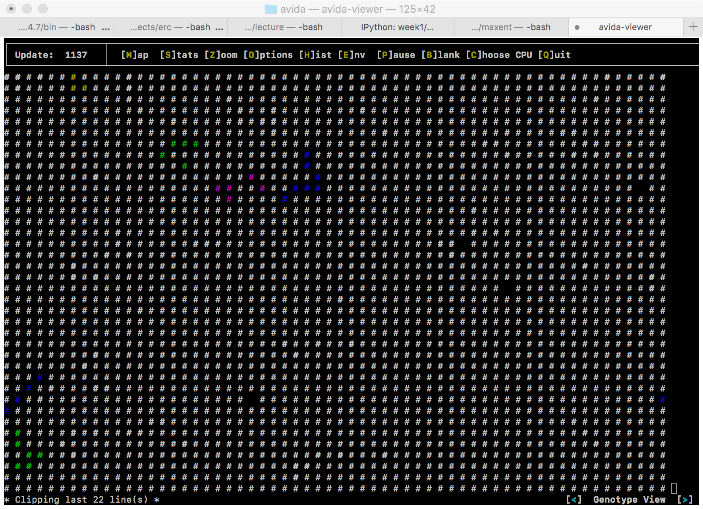
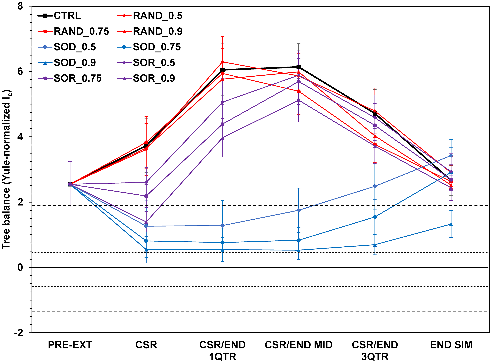
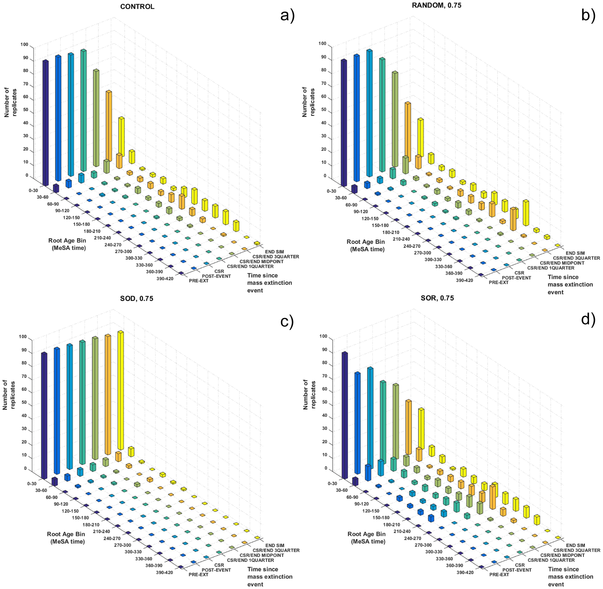

Topological analysis
====================

**G-D Yang, P-M Agapow & G Yedi**, 2017. The tree balance signature of mass extinction is 
erased by continued evolution in clades of constrained size with trait-dependent 
speciation. _PLoS ONE_ **12**(6): e0179553
doi:[10.1371/journal.pone.0179553](https://doi.org/10.1371/journal.pone.0179553)

- What happens to the signatures of mass extinctions or radiations (such as imbalance or
  "stemminess")? 
- Wouldn't they eventually be swamped?
- What can we learn from simulation?

Experimental evolution using [Avida](http://avida.devosoft.org/)
----------------------------------------------------------------

_Avida is a free, open source scientific software platform for conducting and analyzing 
experiments with self-replicating and evolving computer programs. It provides detailed 
control over experimental settings and protocols, a large array of measurement tools, 
and sophisticated methods to analyze and post-process experimental data._

Effect on tree balance of mass extinction
-----------------------------------------

**Change in tree balance at select time points after mass extinction episode in 
communities of avida digital organisms.**

- Mass extinction treatments were applied _randomly and instantaneously_ (pulse) or by 
  _massive environmental change_ over a period of time (press), at strong and weak 
  intensities.
- The y-axis is Aldous's β [βA] a measure of tree balance applicable to 
  non-dichotomous trees; a Yule expectation is around zero, while more negative values 
  indicate trees more imbalanced than this expectation.
- Data points are averages of 100 replicates ± 2 standard errors. Solid traces are 
  maximum likelihood estimates of βA, dashed traces are 95% confidence 
  intervals around the calculated βA estimates. βA values (with 
  confidence intervals) were determined using a customized version of the 
  `maxlik.betasplit` function in the R package apTreeshape (courtesy M. Blum).
  
Tree simulation using [MeSA](http://www.agapow.net/software/mesa/)
------------------------------------------------------------------

- The Avida analyses imply a "recovery" model until saturation, which might swamp sooner
- There is no facility to explore traits interacting with diversification
- More can be accomplished by [scripting](http://datadryad.org/resource/doi:10.5061/dryad.sm379/15)
  tree simulations in MeSA

Exemplar phylogenetic trees showing change in balance and trait/rate values over time.
Branch lengths are scaled in MeSA absolute time. Tips are coloured according to trait 
value ranges shown in colour scale at bottom.

- **a)** t = 165, trait variance approximately 1, increasing
- **b)** t = 320, trait variance at half-maximum, increasing
- **c)** t = 400, maximum variance
- **d)** t = 420, half-maximum, descending
- **e)** t = 520, variance < 1 but still strong imbalance, descending.
- **f)** t = 600, variance at end-simulation

Parameterization of the extinction events
-----------------------------------------

Three mass extinction treatments were employed: 

- _Random_ = taxa were culled from the tree regardeless of trait value or phylogenetic 
  position. 
- _Selective-on-diversifiers_ = taxa culled from the tree had the lowes trait value and 
  highest speciation rates.
- _Selective-on-relicts_ = those taxa with highest trait value and lowest speciation 
  rates were culled preferentally. 

Each of the treatments occurred at intensity: 
- 90%
- 75% 
- 50% of all the extant taxa in the tree

Post-simulation analysis
------------------------

- NEXUS files produced by MeSA were then manipulated in R to compute Ic values
  using the function `colless` for each tree in a time series and treatment
  [MESA_output files](http://datadryad.org/resource/doi:10.5061/dryad.sm379)
- The treatments were coded as:
  - `RAND` = random extinction 
  - `SOD` = selective-on-diversifiers
  - `SOR` = selective-on-relicts
  - 0.5, 0.75, and 0.9 refer to extinction intensity
- Short-dashed lines above and below the zero line indicate boundaries of inner Yule 
  zone; long-dashed lines indicate outer Yule zone boundaries. 
- For the three treatments combined with the different intensities and the control, 
  Ic values were collected at points:
  - `PRE-EXT` = pre extinction time (`300`) 
  - `CSR` = clade-size recovery
  - `CSR/END 1QTR` = simulation first-quarter
  - `CSR/END MID` = midpoint
  - `CSR/END 3QTR` = three-quarter point
  - `END SIM` = at the end of simulation (`600`)
- In addition, values were collected at:   
  - post extinction event (`305`)
  - at the CSR end-mid time (`470`)

Hypothesis tests
----------------

- Ic values were later rearranged in EXCEL and exported in txt files to be 
  used for the statistical analyses.   
- The treatments involving a combination of extinction types and intensity were analyzed 
  with two-way ANOVA and Tukey-corrected multiple comparison testing, in order to see if 
  there are any significant treatment-by-intensity interactions. 
- To test whether the various extinction treatment outcomes differed systematically from 
  the control and pre-treatment reference points,  Dunnett's tests were perfomed, using 
  either pre-treatment or the control treatment as the reference standard.
